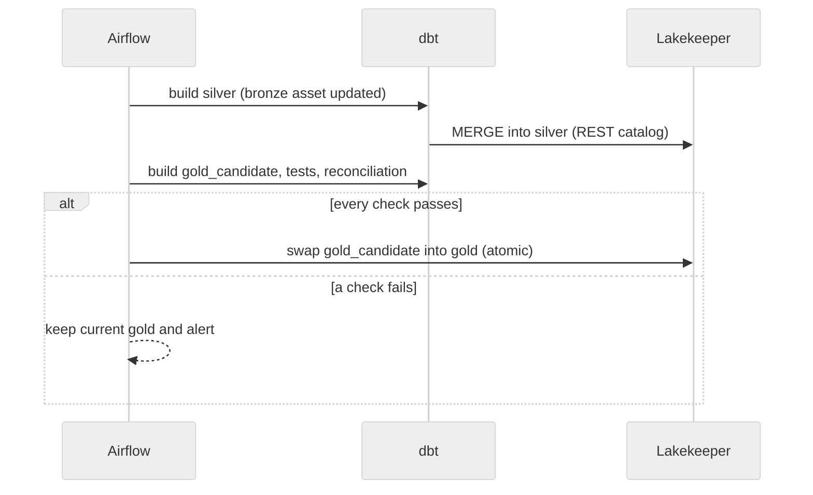
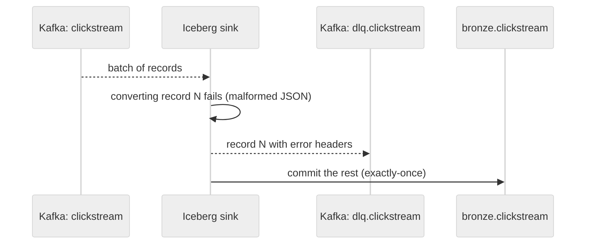

# Shopstream Spec — Document Templates

Scaffolds for `/shop-spec` Phase 2 (frontmatter) and Phase 4 (sections). The ADR body lives in one place, `docs/tooling/adr-template.md` (MADR 4.0), which `just adr-new` renders.

## Frontmatter Templates

### PRD

```yaml
---
title: "<Data product name>"
type: prd
status: Draft
owner: analytics-eng # platform | analytics-eng | governance
version: 1.0.0
created: <YYYY-MM-DD>
updated: <YYYY-MM-DD>
decided-by:
  - ../../adr/adr-NNN-<topic>.md # ADR(s) that ratified this PRD's approach
---
```

### TRD

```yaml
---
title: "<Pipeline or job> — Design"
type: trd
status: Draft
owner: platform
version: 1.0.0
created: <YYYY-MM-DD>
updated: <YYYY-MM-DD>
implements:
  - prd-<kebab>.md # PRD(s) this TRD implements
decided-by:
  - ../../adr/adr-NNN-<topic>.md
depends-on:
  - ../platform/ref-architecture.md
---
```

### ADR

`just adr-new "<title>" [owner]` writes this frontmatter from `docs/tooling/adr-template.md`:

```yaml
---
title: "ADR-NNN: <Title>"
type: adr
status: Draft
owner: platform
decision: "<One-line binding decision>"
created: <YYYY-MM-DD>
updated: <YYYY-MM-DD>
---
```

ADRs don't use `version:`.

### REF

```yaml
---
title: "<Subject> Reference"
type: ref
status: Draft
owner: platform
version: 1.0.0
created: <YYYY-MM-DD>
updated: <YYYY-MM-DD>
informs:
  - ../<domain>/trd-<kebab>.md # docs this REF gives authority to
---
```

### GUIDE

```yaml
---
title: "<Task> Guide" # runbooks: "Runbook: <failure>"
type: guide
status: Draft
owner: platform
created: <YYYY-MM-DD>
updated: <YYYY-MM-DD>
depends-on:
  - ../platform/ref-architecture.md
---
```

### GLOSSARY

```yaml
---
title: "<Area> Glossary"
type: glossary
status: Draft
owner: analytics-eng
created: <YYYY-MM-DD>
updated: <YYYY-MM-DD>
---
```

---

## Text Diagram Standards

Every diagram is text-based. The normative rules are in `docs/specs/guide/guide-doc-style.md` §4; this section adds patterns.

### Approved Formats

| Format                    | Use for                                                          | Block type             |
| ------------------------- | ---------------------------------------------------------------- | ---------------------- |
| Mermaid `sequenceDiagram` | Control flow, request/response, failure and replay paths         | `mermaid` fenced block |
| Mermaid `flowchart LR/TD` | Topology and data flow with labeled edges                        | `mermaid` fenced block |
| ASCII box-and-arrow       | Inline quick reference                                           | plain code block       |

### Rules (every diagram)

- **Init line:** every Mermaid block starts with `%%{init: {'theme': 'neutral'}}%%`.
- **Node labels:** verbatim component names (`Debezium`, `Kafka`, `Iceberg sink`, `Lakekeeper`, `dbt`, `Spark`), no abbreviations.
- **Edge labels:** the protocol or payload (`CDC envelope (Avro)`, `Iceberg commit`, `REST catalog`, `MERGE`).
- **Arrows:** sync edges solid; async edges dashed.
- **Participant order:** initiator left, responder right; async consumers last.
- **ASCII width:** at most 80 characters.
- **Caption:** directly above the diagram, `> **Figure N**: <one-line description>`.

### Example Patterns

**Data flow** (`flowchart LR`):

> **Figure A**: Order changes from Postgres to bronze.


**Control flow** (`sequenceDiagram`):

> **Figure B**: Airflow asset chain from bronze to a published gold layer.



**Failure and replay flow** (`sequenceDiagram`):

> **Figure C**: A malformed clickstream record goes to the sink's dead-letter topic while the rest commit.



---

## Section Scaffolds

### PRD Scaffold (a data product)

````markdown
# <Data product name>

## Objective and Consumers

> One paragraph: who consumes this data product, what decision it supports, and what "good" looks like.

| Consumer            | Uses it for            | Access path                          |
| ------------------- | ---------------------- | ------------------------------------ |
| <persona or system> | <decision or workload> | <gold table / metric / MCP tool>     |

## Functional Requirements

| ID   | Requirement | Owner         |
| ---- | ----------- | ------------- |
| FR-1 |             | analytics-eng |

## Non-Functional Requirements

> SLI/SLO format: the measurement, the window, the bound, and the proof. Each row must be testable or monitorable.

| ID     | Dimension    | SLI (what is measured)                            | SLO (bound) | Window          | Proof                           |
| ------ | ------------ | ------------------------------------------------- | ----------- | --------------- | ------------------------------- |
| NFR-01 | Freshness    | Age of the newest gold row vs the source commit   | ≤ 60 min    | Rolling 24 h    | freshness test                  |
| NFR-02 | Completeness | Gold order count vs Postgres order count          | Δ ≤ 0.1 %   | Per build       | reconciliation model            |
| NFR-03 | Correctness  | SCD2 versions with overlapping validity           | 0           | Per build       | `non_overlapping_validity` test |
| NFR-04 | Availability | Successful scheduled gold publishes               | ≥ 99 %      | Rolling 30 days | Airflow run history             |
| NFR-05 | Security     | Reads of gold by an identity without a grant      | 0 (denied)  | Per request     | `just test-authz`               |

## Acceptance Criteria

- WHEN [trigger] THE SYSTEM SHALL [observable behavior]
- IF [precondition] THEN THE SYSTEM SHALL [behavior]
- THE SYSTEM SHALL [always-on requirement]

## Out of Scope

- <what this data product deliberately doesn't cover>

## Open Questions

| #   | Question | Owner | Target week |
| --- | -------- | ----- | ----------- |
| 1   |          |       |             |
````

### TRD Scaffold (a pipeline or job)

````markdown
# <Pipeline or job> — Design

## §1 Objective

| Attribute | Value                                                          |
| --------- | -------------------------------------------------------------- |
| Component | <pipeline, job or service>                                     |
| Owner     | platform / analytics-eng / governance                          |
| Runtime   | <Compose profile: core / streaming / orchestration / obs / ai> |
| Inputs    | <topics, tables, APIs>                                         |
| Outputs   | <tables, topics, metrics>                                      |
| Key ADRs  | <adr-NNN, adr-NNN>                                             |

## §2 Architecture

### Data Flow

> **Figure 1**: <source → transform → sink; label every hop with protocol and payload>

### Control Flow

> **Figure 2**: <what triggers the job (schedule, asset update, Kafka event) and what it triggers next>

### Failure and Replay Flow

> **Figure 3**: <retries, dead-letter routing, backfill and rebuild paths; where idempotency comes from>

## §3 Data Model / Contract

> Include the sub-sections that apply; omit the rest.

### Topic and Schema Contract _(omit if the component touches no Kafka topic)_

| Topic     | Key           | Schema subject  | Compatibility | Retention / compaction | Producer    | Consumers    |
| --------- | ------------- | --------------- | ------------- | ---------------------- | ----------- | ------------ |
| `<topic>` | `<key field>` | `<topic>-value` | BACKWARD      | 7 d / compacted        | <component> | <components> |

### Table Contract _(omit if the component writes no table)_

| Table                 | Format version | Partitioning / sort | Sole writer | Readers      | PII columns (metrics `none`) |
| --------------------- | -------------- | ------------------- | ----------- | ------------ | ---------------------------- |
| `<namespace>.<table>` | 3              | `<transform(col)>`  | <component> | <components> | `<col>`                      |

Grain: <one row per …>. Keys: <natural key> → <surrogate key>.

### Job Contract _(omit for pure topic or table docs)_

| Job     | Trigger                | Inputs → outputs | Idempotency key            | Retry / timeout      | SLO               |
| ------- | ---------------------- | ---------------- | -------------------------- | -------------------- | ----------------- |
| `<job>` | <cron / asset / event> | `<in>` → `<out>` | <what makes a re-run safe> | <n × backoff, limit> | <freshness bound> |

### Config Registry _(omit if the component has no configuration)_

| Key     | Where it's set                           | Default        | Secret? | Description        |
| ------- | ---------------------------------------- | -------------- | ------- | ------------------ |
| `<KEY>` | Compose env / dbt var / Airflow variable | <default or —> | no      | <what it controls> |

## §4 Risk Assessment

| Risk | Likelihood | Impact | Mitigation | Proof |
| ---- | ---------- | ------ | ---------- | ----- |
|      |            |        |            |       |

## §5 Testing Strategy

| Layer          | Scope                                   | Shopstream example                                                 |
| -------------- | --------------------------------------- | ------------------------------------------------------------------ |
| Unit           | Pure logic, macros, transforms          | dbt unit test: out-of-order CDC updates apply in source-LSN order  |
| Integration    | One component against real neighbours   | Spark writes a v3 table; DuckDB reads the same snapshot id         |
| E2E / game day | A failure injected across the stack     | Kill the Connect worker mid-commit; no duplicates, no gaps         |

Observability assertion (EARS): WHEN <condition> THE SYSTEM SHALL emit <metric, log or alert> within <bound>.

## §6 Operational Boundaries

| Tier         | Rule |
| ------------ | ---- |
| ✅ Always    |      |
| ⚠️ Ask first |      |
| 🚫 Never     |      |
````

### REF Scaffold

````markdown
# <Subject> Reference

> **SSOT declaration:** this document is the single source of truth for <subject>.
> Consumers: <docs and components that rely on it>.

## Overview

## <Core definitions: subject-specific sections>

## Precedence Rules

> How conflicts between entries, or with other documents, are resolved.
````

The system-wide reference architecture has its own nine-section spine: `docs/specs/platform/ref-architecture.md`.

### GUIDE Scaffold (runbooks included)

````markdown
# <Task> Guide

## Overview

**Prerequisites:**

- <what must be true before starting>

## Procedure

1. <step>

## Troubleshooting

| Symptom | Likely cause | Fix |
| ------- | ------------ | --- |
|         |              |     |

## Operational Boundaries

| Tier         | Rule |
| ------------ | ---- |
| ✅ Always    |      |
| ⚠️ Ask first |      |
| 🚫 Never     |      |
````

For a runbook (`guide-runbook-<failure>.md`), the Overview names the alert or symptom that opens it and the SLO it protects, and the Procedure ends with the check that proves recovery.

### GLOSSARY Scaffold

````markdown
# <Area> Glossary

| Term | Definition | Defined by                 |
| ---- | ---------- | -------------------------- |
|      |            | [<doc>](<relative path>)   |
````

---

## Completeness Checklists

Run these before advancing `status` beyond `Draft`.

### PRD Checklist

- [ ] The Consumers table has at least 1 row
- [ ] The FR table has at least 1 row with ID, requirement and owner role
- [ ] Acceptance Criteria has at least 3 EARS statements
- [ ] Every NFR has an SLI, a quantified SLO, a window and a proof
- [ ] NFRs cover freshness, completeness and security at minimum
- [ ] Out of Scope is present and non-empty

### TRD Checklist

- [ ] §1 Objective is the 6-row attribute table
- [ ] §2 has Data Flow, Control Flow and Failure and Replay Flow, each with a captioned diagram
- [ ] §3 Table Contract names exactly one sole writer per table, consistent with `ref-architecture.md` §6
- [ ] §3 Topic Contract states the compatibility mode and retention per topic
- [ ] §3 Job Contract states an idempotency key per job
- [ ] The §4 Risk table has at least 1 row with a mitigation and a proof
- [ ] §5 covers unit, integration and E2E / game day, and names the tests
- [ ] §6 has at least 1 rule per tier

### ADR Checklist

- [ ] Context and Problem Statement ends in the question the decision answers
- [ ] At least 2 Considered Options, each with Pros and Cons
- [ ] Decision Outcome names the chosen option and why
- [ ] Consequences has at least one Good and one Bad entry
- [ ] Confirmation names the test, CI gate or review that fails on a violation
- [ ] The `decision:` frontmatter matches the Decision Outcome

---

## Phase 7 — Compression Checklist

Run this after writing. Fix each violation inline before committing.

```
SPEC COMPRESSION CHECKLIST (Phase 7a)
──────────────────────────────────────
□ §1 Objective is an attribute table (≤ 6 rows), not prose
□ Every FR, NFR and AC is a table row or an EARS line, not a prose bullet
□ Rejected options live in Pros and Cons (ADRs) or an "Option | Why not" table
□ No background paragraph longer than 3 sentences before the first section heading
□ Cross-references replace re-explanations: link to the SSOT, don't copy it
□ No "Note that…", "It is worth mentioning…" or "It should be noted…"
□ Open Questions is a numbered table only
□ A diagram, not prose, carries every architecture flow
□ Config and tier classifications are tables, not bullet lists
□ Every AC uses EARS
□ `decision:` (ADRs) or the §1 table (TRDs) gives a one-line summary of the binding content
□ No authoring residue: git and the PR description hold history, scores and patch lists
```

Then run `uv run pytest tests/test_docs_integrity.py -q`.
