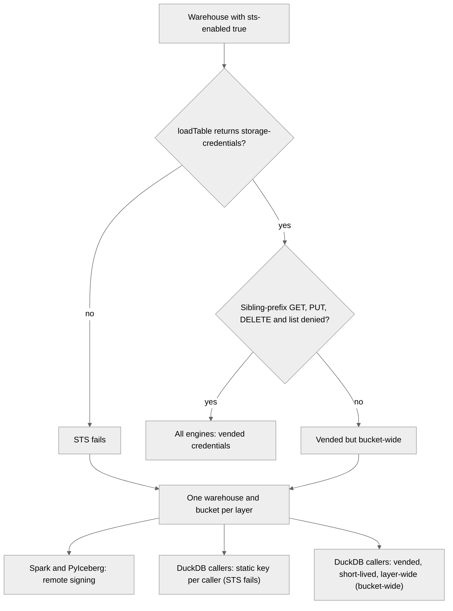

# ADR-001: Feasibility spike

## Context and Problem Statement

The [reference architecture](../specs/platform/ref-architecture.md) describes a target stack whose load-bearing parts are young or unproven together: Lakekeeper 0.13 vending SeaweedFS credentials, Iceberg v3 writes from Spark and dbt 2.0, the Iceberg sink committing to a REST catalog, and three KRaft brokers beside Spark and Airflow on one 16 GB laptop. A failure found in Week 9 or Week 14 would force a redesign after later weeks have built on it. Which stack does Shopstream build on, and what does each risky part fall back to when the Week 2 spike shows it doesn't work?

## Decision Drivers

- Every later week builds on these choices, and switching after Week 4 rewrites finished work.
- A choice counts only with public, reproducible evidence: a probe, its command and its output.
- Each fallback is fixed before the probe runs, so the result can't bias it and the build week makes no design choices.
- $0 on one 16 GB laptop; the `core + streaming + orchestration` combination stays within 10 GiB (INV-20).
- The platform gotchas in `AGENTS.md` §6 (G1 to G12) bound what each engine can do.

## Considered Options

- Spike-gated target stack: the reference-architecture stack, 15 probes, and a fallback fixed per probe
- Target stack without a spike: adopt it as written and fix problems in the week that hits them
- Conservative stack now: take every fallback up front (dbt-core 1.x with dbt-duckdb, Iceberg v2, one broker, static bucket keys)
- Managed platform: build on Databricks Free Edition instead of a laptop stack

## Decision Outcome

Chosen option: "Spike-gated target stack", because it keeps the target design wherever the probes pass and costs one week, while each fallback is still a working design that later weeks can build on. The conservative stack gives up Iceberg v3 and storage-layer authorization before knowing they fail, and the managed platform has no Kafka, Debezium or self-hosted catalog to learn or prove. This is also the ADR that `AGENTS.md` §1 requires before any service or package in the [Version matrix](#version-matrix) is added.

### Spike items

Each row fixes the choice when the item's [go criterion](#go-criteria) passes and the fallback when it fails. Owner roles follow `docs/CONTRIBUTING.md` Owners.

| #   | Question | If go | Fallback | Owner |
| --- | -------- | ----- | -------- | ----- |
| 1   | Are Lakekeeper's vended SeaweedFS credentials scoped to one table? | Every engine uses vended credentials | [Credential fallbacks](#credential-fallbacks), Figure 1 | platform |
| 2   | Does Spark 4.1 with Iceberg 1.11 write v3 that other engines read? | `sessions` is v3 with a `VARIANT` payload | A reader that can't read `VARIANT` gets a JSON string column; if deletion vectors fail or aren't applied by a reader, v2 with position deletes | platform |
| 3   | Does dbt 2.0 build and `MERGE` v3 Iceberg models? | Silver and gold are built by dbt 2.0 | dbt-core 1.x with dbt-duckdb on standalone DuckDB ≥ 1.5.3, which writes v3 (G4); G11 then no longer applies | analytics-eng |
| 4   | Can the MetricFlow sidecar serve metrics from dbt 2.0's semantic manifest over gold? | MetricFlow in its own uv project with its own lockfile, outside the workspace venv | The Boring Semantic Layer over gold | analytics-eng |
| 5   | Does Debezium 3.6 into the Iceberg sink land every change exactly once, and can the sink commit to a branch? | Bronze uses write-audit-publish ([Bronze rollback](#bronze-rollback)) | A lost change or an offset gap: a Spark job replaces the sink as the CDC writer ([Bronze CDC writer fallback](#bronze-cdc-writer-fallback)). No branch commit: bronze has no WAP, and silver's dbt tests are the audit | platform |
| 6   | Does an Airflow 3.3 `AssetWatcher` on a Kafka `MessageQueueTrigger` fire a DAG? | The FX refresh is event-driven | The FX refresh runs on a 5-minute schedule | platform |
| 7   | Can gold switch to a new build without readers seeing a broken or mixed gold? | View repoint, with the [publish-id rule](#gold-publish) | Table rename, with the same rule and readers retrying on not-found | analytics-eng |
| 8   | Does `core + streaming + orchestration` fit the RAM budget? | 3 KRaft brokers, replication factor 3 | 1 broker, and game day #1 becomes an outage-and-retry test. If 1 broker still doesn't fit, Spark leaves that combination and runs only with orchestration stopped | platform |
| 9   | Which dbt 2.0 features work with no dbt account login? | No login and no CI secret; login-gated features (SQL comprehension, type checking, column-level lineage) stay local | A free-account token becomes a GitHub Actions secret, scoped to the one job that needs it, in a workflow that never runs on `pull_request_target` | analytics-eng |
| 10  | Does a self-hosted Frankfurter serve the dlt FX pipeline offline? | v2 API with `providers=ECB` | v1 API, which serves ECB rates only | platform |
| 11  | Which field orders CDC changes, and which drives SCD2 validity? | Per-key order by `source.lsn`; validity from the simulated `updated_at` ([Delete validity](#delete-validity)). [ADR-004](adr-004-time-model.md) makes it final | Order by `source.sequence` (commit LSN, then change LSN), parsed as two numbers rather than compared as text; an `updated_at` tie or inversion is a generator defect that Week 3 fixes, never a case the dbt macro works around | platform |
| 12  | Can Kafka carry the Week 14 clickstream volume into bronze? | Kafka carries the Week 14 volume | Spark bulk-loads it into its own bronze table (reference architecture §6), with an `event_id` range disjoint from the live stream's; Kafka carries a smaller live stream | platform |
| 13  | Does each messiness knob reach bronze by its path? | The [Knob paths](#knob-paths) table stands | A knob that can't reach bronze moves to a path that can, recorded here | platform |
| 14  | Can Spark run with the repo's Python 3.13? | `python:3.13-slim` plus a Java 21 JRE and PySpark from `uv.lock`, Spark in local mode | The official Spark image with Python 3.13 added and `PYSPARK_PYTHON` pointing to it (G12) | platform |
| 15  | PySpark 4.1 or 4.2? | PySpark 4.2, and the same PR updates G4 in `AGENTS.md` §6, which names only Spark 4.1 | PySpark 4.1, which G4 names as a v3 writer | platform |

### Go criteria

1. `loadTable` with `vended-credentials` returns `storage-credentials`. `scripts/probe_scope.py` gets 200 for GET and PUT inside the table location, and AccessDenied for GET, PUT, DELETE and list on a sibling table's prefix and on the warehouse root. An `AssumeRole` from any identity except `lakekeeper` is denied. With authentication off, read-only vending can't be tested, so Week 5 reruns the probe with `--read-only` as `reader-agent`. A failure there is recorded in an ADR that amends this one (`amends:`) and takes the static-key branch of Figure 1.
2. A v3 table with a `VARIANT` column; `MERGE` with `write.merge.mode=merge-on-read` commits deletion vectors. PyIceberg, Polars and DuckDB each read the same snapshot id with the same row count and the same row hashes as Spark. One tested helper in `scripts/` computes the hash from each engine's Arrow output: sha256 over the columns in a fixed order, with `VARIANT` (or its JSON-string fallback) as canonical JSON with sorted keys, timestamps as UTC microseconds, decimals as strings and a sentinel for null.
3. An incremental model built through `catalogs.yml` v2 (`use_catalogs_v2`) with `format-version=3` shows `"format-version": 3` in `metadata.json`. A second run `MERGE`s one update and one delete, and the table then equals the expected rows exactly.
4. `mf query` for one metric returns the same rows as hand-written SQL over gold, and `dbt` 2.0 and MetricFlow's `dbt-core` each keep a working `dbt` CLI.
5. Bronze lands the raw Debezium envelope, so every row keeps `op` (`r` included) and `source.lsn`; Iceberg's `DebeziumTransform` maps `r` to an insert and drops `source.lsn`, so the sink doesn't use it. Every row carries its Kafka partition and offset (the sink's `KafkaMetadataTransform`). After a `kill -9` of the Connect worker during a commit and a restart, the set of (partition, offset) pairs in bronze equals the offsets of the non-null records a `read_committed` consumer reads up to a fixed end offset, with no duplicates. A plain range would miss the gaps that transaction markers and compaction leave, and the sink writes no row for a tombstone (a null value). The control topic's `START_COMMIT`, `DATA_COMPLETE` and `COMMIT_COMPLETE` events around the kill show which commit stage it hit. The evidence reports three counts together: `count(*)`, the distinct (primary key, `source.lsn`) pairs, and the Postgres change count. The run starts with empty captured tables, so it has no `op=r` rows (item 11 checks those), and the change count comes from a second logical replication slot (`test_decoding`), created before the workload's first write and read with `pg_logical_slot_get_changes` up to the same end LSN, counting only the INSERT, UPDATE and DELETE rows of the captured tables. The distinct count equals the change count, so no change is lost; `count(*)` minus the distinct count is the changes Debezium re-sent after the restart, which the silver macro collapses across batches, not only within one (INV-09). A delete lands as exactly one `op=d` row, and its tombstone lands none. With `iceberg.tables.default-commit-branch=audit`, `main` doesn't move until a fast-forward. A Spark erasure `DELETE` and a `rewrite_data_files` both commit on `audit` while it's ahead of `main`; the next fast-forward still succeeds, the deleted rows are absent from both refs, and after `expire_snapshots(older_than => <now>, retain_last => 1)` (ADR-002's immediate-expiry exception path, with no branch or tag retention keeping older snapshots) no data file any snapshot references still holds them. Both rollback paths below replay with no gap or duplicate.
6. One message on a topic starts a DAG run within 60 s, and a second message starts a second run.
7. Every gold object carries a `publish_id` column. A DuckDB reader polls every 100 ms across 20 switches in each direction and applies the publish-id rule's single retry. It never sees a missing object and never accepts a result that mixes two `publish_id` values. The evidence reports the raw mixed-read count before the retry, which measures the window, and the `PublishInProgress` count, which must be 0. The semantic layer's and MCP server's own retry gets its test in Week 21, when they land.
8. Run first, under item 12's load generator at 3 brokers: `just mem-report` samples `docker stats` every 5 s for the whole run, with the Connect sink, item 2's v3 `MERGE` job on the item 14 image, and a DAG run that executes item 3's dbt build inside the Airflow container, with DuckDB's `memory_limit` set, all active. The peak summed sample is at most 10 GiB, the `mem_limit` values sum to at most the VM size minus 1 GiB, and `docker inspect --format '{{.Name}} {{.State.OOMKilled}} {{.RestartCount}}'` shows no `OOMKilled` and no restart; the format keeps each container's environment out of the capture. A 5 s sample can miss a short peak, which the OOM and restart checks catch; the evidence states this limit. A fallback reruns items 8 and 12. The other allowed combinations are measured when their profiles land: `core + streaming + obs` in Week 16, `core + ai` in Week 21.
9. `dbt build`, `dbt lint` and docs lite run in CI with no login. The evidence notes that a login sends project metadata to dbt Labs.
10. Seeded online once, then with the network cut, the pipeline loads ECB rates, and the rates skip weekends and ECB holidays.
11. A 10-minute run (inserts, updates, deletes, one `ALTER TABLE`) with `track_commit_timestamp=on`. Every streamed change carries `source.lsn`; per key, `source.lsn` order matches commit order; the simulated `after.updated_at` on `c`, `u` and `r` rows rises strictly in that order, with ties and inversions counted; the fallback's `source.sequence` order is checked the same way. Snapshot rows (`op=r`) come one per key, before any streamed change for that key, so the history backfill starts only after the replication slot exists. Every `op=d` row's `before.updated_at` equals the simulated delete time, with one `op=u` row in the same transaction; that `op=u` row's `updated_at` equals it by design, so the pair isn't counted as a tie.
12. The sink's `iceberg.control.commit.interval-ms` is set to 60 s and stated. At least 5 commits carrying at least 5M events reach bronze through 3 brokers (replication factor 3); at 14,000 events/s, the four intervals between 5 commits alone hold about 3.4M. Committed throughput is the rows in commits 2 to N divided by the time from commit 1 to commit N, and it's at least 14,000 events/s, which loads 50M in about 1 h. The (partition, offset) set in bronze equals the non-null records the load generator produced between its start and end offsets, and the generator's count of intended duplicates is reported beside it, so item 13's duplicate knob isn't read as sink duplication. Disk per million events is recorded, and 50M events at replication factor 3 plus their bronze files project to at most 75% of the Colima VM's disk, whose size the evidence records.
13. Each knob in [Knob paths](#knob-paths) is detected in bronze by its own check, during items 11 and 12.
14. An image pinned by digest runs item 2's job, and both the driver and a Python UDF report Python 3.13.
15. Maven Central has an Iceberg 1.11 runtime for Spark 4.2, and item 2 passes on it.

### Decided now

These don't wait for a probe.

| Topic | Decision | Why | Owner |
| ----- | -------- | --- | ----- |
| Catalog auth during the spike | Lakekeeper runs with authentication off (`allowall`), a spike-only exception to reference architecture §3. Week 5 empties the catalog database, the warehouse buckets and the Kafka and Connect volumes, then bootstraps with OIDC and OpenFGA | The spike's state is throwaway. A bootstrap with authentication off records no admin, switching to OpenFGA later carries no grants over (G6), and spike files left without a catalog could never be erased | platform |
| Published ports | Every published Compose port binds to `127.0.0.1`, and `tests/test_repo_policy.py` fails any other binding | With `allowall`, anyone who reaches Lakekeeper gets write credentials | platform |
| Container runtime | Colima on the Apple Virtualization framework (`vz` VM, virtiofs mounts), VM memory 12 GiB and 4 CPUs, listed in the README prerequisites | Colima's default 2 GiB VM can't hold a 10 GiB budget, and changing the runtime changes item 8's baseline. The [Version matrix](#version-matrix) records why Colima and not Docker Desktop | platform |
| Storage secrets | `infra/.env` holds every key; `infra/.env.example` holds placeholders. `just up` renders SeaweedFS's identity file from `infra/.env` into a git-ignored path. Lakekeeper's own identity gets the bucket actions its commits need plus `sts:AssumeRole`, and no `Admin` | The identity file holds long-lived keys even on the go path | governance defines, platform runs |
| Connector secrets | Connect workers load Kafka's `EnvVarConfigProvider` with an `allowlist.pattern`, so connector JSON and the Connect config topic hold only `${env:…}` placeholders | The config topic and `GET /connectors/<name>`, which the rollback calls, would otherwise hold and return the Postgres password and storage keys in plaintext | platform |
| Trust policy | SeaweedFS's vended role trusts only the `lakekeeper` identity, never `Principal: "*"` | Any identity could otherwise assume a bucket-wide role | platform |
| Lakekeeper maintenance queues | Item 1's stack confirms through Lakekeeper's management API that 0.13.x still has the expire-snapshots and orphan-removal queues, and that both are off | INV-07 depends on them staying off until ADR-002 names an owner | platform |
| Evidence | `docs/evidence/w2-spike.md`, under the [Evidence rules](#evidence-rules) | One place a reviewer can check every result | platform |

### Credential fallbacks

> **Figure 1**: Item 1's result picks the storage-access mode for each engine.

DuckDB can't remote-sign (G2), so both failure branches leave DuckDB callers outside OpenFGA at the storage layer; OpenFGA still decides which tables they can load. Both branches therefore give each layer its own Lakekeeper warehouse on its own bucket: bronze, silver, gold, `gold_candidate` (with any retired gold copy), and the Spark-owned tables. A key then reaches at most one layer, and `reader-agent` can't read an unpublished candidate that might still hold an erased subject (INV-11). Table names stay `<layer>.<table>`. Reference architecture §5 already states the static-key case; the settling PR updates §6 for the warehouse split.

**Static-key branch** (STS fails):

- Each DuckDB caller gets its own SeaweedFS identity, allowed only the buckets its reference architecture §6 row lists: `dbt-transformer` reads bronze and writes silver, gold and `gold_candidate`; `reader-agent` reads gold only; any other DuckDB or Polars session, such as item 7's poller, uses a read-only identity with `reader-agent`'s scope. `just test-authz` holds one allow and one deny case per identity (INV-21, INV-27, and INV-06 at the storage layer).
- A static key has no expiry of its own, so it's rotated: at every catalog bootstrap, at most 30 days apart, and at once after any suspected leak. A rotation writes a new key to `infra/.env` with its creation date beside it, and removes the old one from the identity file; `just test-authz` reads that date and fails on a key older than 30 days. `governance` owns this policy and `platform` runs it.

**Bucket-wide branch** (vended, but a sibling-prefix request succeeds):

- Vended credentials expire within 1 h (SeaweedFS `sts.tokenDuration`), and the trust policy admits only `lakekeeper`.
- The vended role's attached policy covers only its warehouse's bucket and grants no `s3:ListBucket`, so table paths are known only to callers the catalog serves.
- The residual risk is accepted and named: a caller holding a vended key for one layer can read or overwrite any object in that layer whose path it knows. `reader-agent` only ever loads gold, so it never holds a key for bronze or silver.
- The settling PR adds this invariant to reference architecture §8: "INV-28: if vended credentials are bucket-wide, each one reaches only its own layer's bucket, expires within 1 h, and can't list the bucket", proven by `scripts/probe_scope.py` inside `just test-authz` (Week 5).

### Bronze rollback

A rollback repairs faults the sink causes, such as a gap or a duplicate. It can't repair bad source data, which silver quarantines. Both paths reach back only as far as Kafka retention, and on the compacted `customers` topic only as far as `min.compaction.lag.ms`, because older records keep just their key's latest value. ADR-002 sets that lag at least as long as the rollback window.

The replay offsets come from the rows, not the snapshot summary. The sink's `kafka.connect.offsets.*` snapshot property holds its control-topic offsets, not the source topics'. So for each source partition, the connector resumes one past the highest `KafkaMetadataTransform` offset among the rows of the snapshot the rollback restores (`PATCH /connectors/<name>/offsets`). A partition with no rows in that snapshot resumes at its log-start offset.

- **Branch works:** the sink commits to `audit`, and so do Spark's erasure `DELETE` and maintenance, so `main` only ever moves by fast-forward. A Spark job checks the (partition, offset) set against Kafka, allowing the offsets of rows the ledger erased, then fast-forwards `main`. An erasure reaches `main`'s readers at the next fast-forward, whose interval the evidence records. To discard a bad audit commit: stop the connector, set the offsets from the rows at `main`'s head, recreate `audit` at `main`, and resume.
- **Branch doesn't work:** bronze stays append-only on `main`. To undo a bad commit: stop the connector, run Spark's `rollback_to_snapshot` to the snapshot before it, set the offsets from the rows at that target, and resume. Row offsets can be read at any snapshot, including Spark's compaction, erasure and fast-forward snapshots, which the sink didn't write, so item 5 tests a rollback across one of them.
- Either way, a rollback that passes an erasure `DELETE` would bring the subject back, and so would the replay from Kafka; an erasure can also remove a partition's highest-offset row, so the replay re-lands that record. The rollback therefore reapplies the whole erasure ledger once the replayed commits land, then runs the G10 chain (rewrite, `expire_snapshots`, `remove_orphan_files`) before the next silver build (INV-05). Under WAP the order is the ledger `DELETE` and rewrite on `audit`, then the fast-forward, then `expire_snapshots` and `remove_orphan_files`: expiry keeps every branch head, so running it before the fast-forward would keep `main`'s pre-`DELETE` files. The same order applies to every erasure on a WAP table. A reapply is idempotent on the hashed subject IDs, and the whole ledger also covers an entry appended before its `DELETE` ran. The next silver build then reprocesses bronze from the target snapshot, because replayed records keep their original LSNs and an LSN watermark would skip them. Before Week 5 there's no ledger, and the spike's data is throwaway.

### Bronze CDC writer fallback

If item 5 loses a change or leaves an offset gap, a Spark Structured Streaming job replaces the Iceberg sink as the only writer of the bronze CDC tables (INV-01); the two never write bronze together. Item 5's checks, with one `ALTER TABLE` added to its run, then rerun on the job before the verdict is recorded. The job:

- reads the CDC topics with `kafka.isolation.level=read_committed`, drops tombstones (`value IS NOT NULL`) before the write, keeps the Kafka offsets in its checkpoint, and appends through Iceberg's streaming write, which records the query id and epoch in each snapshot and skips an epoch it already committed, so a restart never commits twice. It doesn't use `foreachBatch`, whose writes aren't idempotent.
- lands the raw envelope with the Kafka source's `partition` and `offset` columns, so item 5's checks and the rollback rule apply unchanged; a rollback starts a new checkpoint with `startingOffsets` taken from the rows. Under WAP, it commits to `audit` like the sink.
- decodes the Confluent wire format itself: each record's 5-byte header gives its Karapace schema id, and a pandas UDF decodes it with that writer schema (fastavro) into the newest registered schema. A newer schema id fails the batch, and the restart replays that epoch from the checkpoint with the new schema and appends with Iceberg schema merge (`write.spark.accept-any-schema`, `mergeSchema`), so an `ALTER TABLE` column appears in bronze as on the sink path. ABRiS, the JVM library for this, supports Spark 4 only in a release candidate.
- triggers every 60 s, the sink's commit interval, so file counts and item 12's commit arithmetic stay comparable.
- runs on the item 14 image. Taking this fallback reruns items 8 and 12 with the job running. The settling PR updates reference architecture §6's writer split, §5's CDC consumer column, and the sink-specific INV-15, game day #4 and connector-stuck runbook, and gives Spark's SCRAM user read-only ACLs on the CDC topics; `spark-writer` already commits on bronze, so Lakekeeper needs no new grant.

### Delete validity

With the default replica identity, a delete's `before` image holds only the primary key, and `source.ts_ms` is wall-clock time, not the simulated clock. So the generator sets `updated_at` to the simulated delete time in the same transaction as the delete, and the captured tables use `REPLICA IDENTITY FULL`, so the delete's `before` image carries that time. [ADR-004](adr-004-time-model.md) confirms both, and its derivations take a delete's time from the pair's `op=u` row. A full `before` image copies every column, PII included, into Kafka and bronze on every update and delete, so INV-08's metrics mode `none` covers the nested `before.*` and `after.*` PII fields in bronze.

### Gold publish

A per-object switch is atomic for one object, not for the whole of gold. A reader joining a new `fct_orders` to an old `dim_customer` mid-publish could see keys with no match. So every gold object carries the `publish_id` of the build that produced it. The semantic layer and the MCP server read each object's `publish_id` directly, one row per object, so an empty query result is still checked. A query that read two values retries once; a second mixed read fails with a named `PublishInProgress` error. An ad hoc DuckDB session can see the window, which item 7 measures. Reference architecture §1.1 states the same rule.

### Knob paths

| Knob | Path to bronze | Detected by |
| ---- | -------------- | ----------- |
| Inserts, updates, deletes and SCD2 changes | CDC | One row per change, with `op` in `c`, `u` or `d` |
| `ALTER TABLE` schema drift | CDC | A new column appears in the bronze schema, and Karapace records a new schema version |
| Late-arriving product | CDC | An `order_items` row whose commit LSN is lower than its product's insert LSN (there's no foreign key on `product_id`) |
| Erasure canary | CDC and clickstream | The canary's hashed token is found in both bronze tables, counted, never printed |
| Seeded prompt-injection review | CDC | Its row lands in bronze; it has to reach gold, which only CDC feeds, and the Week 3 generator names the column |
| Duplicate events | Clickstream | The same `event_id` at two offsets |
| Out-of-order events | Clickstream | Event-time order differs from offset order within a partition |
| Malformed events | Clickstream | A record in the sink's dead-letter topic; Postgres rejects wrong types, so CDC can't carry one |
| Events beyond the watermark | Clickstream | Event time older than the running maximum event time over earlier offsets in its partition, minus the lateness bound the load generator states (Week 13's watermark may change it) |
| Hot key | Clickstream | One product and one customer each hold at least the configured share of events |
| FX weekend and holiday gaps | dlt FX pipeline | Missing dates in `bronze.fx_rates` match the ECB calendar (item 10) |

### Consequences

- Good, because later weeks build on measured behaviour, and each fallback was chosen before its result.
- Good, because the "ADR-001 decides" choices in the reference architecture (writer split, credential mode, blue/green swap, broker count, semantic layer) all resolve in one place.
- Bad, because the spike takes a whole week, and some fallbacks weaken later proofs: a static key moves DuckDB callers outside OpenFGA at the storage layer, per-layer warehouses add catalogs to configure, one broker turns game day #1 into a retry test, and the bronze CDC writer fallback adds a long-running Spark job to the streaming profile's RAM budget.
- Bad, because this Proposed body holds preferences no probe has confirmed yet. A fallback changes reference-architecture text, and that change lands in the PR that settles the item.
- Bad, because running the spike with authentication off means Week 5 empties the stack and bootstraps it again.

### Confirmation

`platform` owns every check here.

- **Before Accepted:** every row of [Results](#results) has a verdict and an `Item N` section in `docs/evidence/w2-spike.md`, and the reference architecture reflects every fallback taken. The reviewer blocks the status change otherwise.
- **`just up` from a clean clone:** it fails fast if the Colima VM has less than 12 GiB, brings `core` up with `docker compose up --wait`, then runs the `bootstrap` and `warehouse` one-shots, exiting 0. A second `just up` also exits 0, and so does `COMPOSE_PROFILES=streaming,orchestration just up`, which starts item 8's combination. All three transcripts go into the evidence file.
- **`just mem-report`** exits 0 under item 12's load (INV-20). Any PR that changes a profile's services or limits reruns it and pastes the result.
- **`tests/test_repo_policy.py`** fails a Compose image without an `@sha256:` digest (INV-02). It gains two checks: every Dockerfile `FROM` line is pinned by digest, so item 14's built image is covered, and every published port binds to `127.0.0.1`.
- **`scripts/probe_scope.py`** stays in the repo, and Week 5's `just test-authz` reuses it for the storage-layer checks.
- **Game day #7** (Week 19) adds an erase, rollback and replay case, after which `just erasure-proof` finds 0 matches.
- **Runbooks:** bronze rollback and key rotation become runbooks under `docs/specs/ingestion/` and `docs/specs/platform/` in Week 20, beside the reference architecture §8 set.

## Pros and Cons of the Options

### Spike-gated target stack

- Good, because the target design survives wherever it works, and each failure has a working design ready.
- Good, because the evidence is public and reruns on the same pins.
- Bad, because a week goes to probes that ship no data product.

### Target stack without a spike

- Good, because Week 2's time goes to building.
- Bad, because a failure such as bucket-wide credentials surfaces in Week 5 or later, after gold, authorization and runbooks assume the opposite.

### Conservative stack now

- Good, because each piece is known to work today.
- Bad, because it gives up Iceberg v3, deletion vectors, storage-layer authorization and replication-factor-3 game days before any probe shows they fail.
- Bad, because dbt-core 1.x is the line dbt 2.0 replaces.

### Managed platform

- Good, because there's nothing to fit into 16 GB.
- Bad, because Databricks Free Edition is serverless only, so Spark Real-Time Mode doesn't run there (G8), and it has no Kafka, Debezium or self-hosted catalog to learn or prove.
- Bad, because the project would no longer be an open lakehouse on a laptop.

## More Information

### Results

Every item starts as "not run". Each verdict is `go` or `fallback`, with a pointer to its evidence section.

| #   | Measured result | Verdict | Evidence |
| --- | --------------- | ------- | -------- |
| 1   | Vended credentials are scoped to the table's own location on Lakekeeper 0.13.6 and SeaweedFS 4.47, and only `lakekeeper` can assume the vended role; Figure 1 branch "All engines: vended credentials" | go | `docs/evidence/w2-spike.md` Item 1 |
| 2   | Spark 4.1.3 wrote four v3 tables with deletion vectors, and DuckDB 1.5.5 matched Spark's snapshot ids, row counts and digests on all four; PyIceberg 0.12.0 and Polars 1.44.2 cannot load a VARIANT table, so they read the payload as a JSON string column and matched on the two JSON-string tables; no reader needs v2 | fallback | `docs/evidence/w2-spike.md` Item 2 |
| 3   | dbt 2.0.6 built format-version 3 and merged, but its bundled DuckDB 1.5.4 writes deletion vectors that DuckDB 1.5.5 rejects; on the owner's call, dbt-core 1.12.5 with dbt-duckdb 1.11.0 on DuckDB 1.5.5 builds `inc_v3` at format-version 3, and Spark and PyIceberg read the merged rows | fallback | `docs/evidence/w2-spike.md` Item 3 |
| 4   | MetricFlow 0.213.0 (mf 0.15.0) in its own uv project returned the same rows as hand-written SQL over gold, grouped by day and in total, on the item 3 fallback runtime; both venvs' `dbt` CLIs report dbt-core 1.12.5, and the dbt 2.0 half was not exercised | go | `docs/evidence/w2-spike.md` Item 4 |
| 5   | Across three Connect worker kills, bronze's 14,559 offsets equal the `read_committed` set with no duplicate, and its 14,389 distinct changes equal the `test_decoding` count; the sink's `audit` branch gives bronze write-audit-publish, and both rollback paths replayed with no gap or duplicate | go | `docs/evidence/w2-spike.md` Item 5 |
| 6   | Two messages on `fx.refresh` started two distinct Airflow 3.3.2 DAG runs, 1.5 s and 0.9 s after the messages, against the 60 s limit | go | `docs/evidence/w2-spike.md` Item 6 |
| 7   | DuckDB 1.5.5 cannot read an Iceberg view that Lakekeeper lists, so gold switches by table rename; over 20 switches each way a 100 ms DuckDB poller with the single retry accepted no missing object and no mixed result, and PublishInProgress was 0 | fallback | `docs/evidence/w2-spike.md` Item 7 |
| 8   | Scope: the clickstream, Spark and dbt combination; CDC load not measured. Peak summed sample 6.74 GiB against 10 GiB, `mem_limit` sum 10.12 GiB against 10.66 GiB, and no OOM kill or restart, on the 12 GiB Colima VM | go | `docs/evidence/w2-spike.md` Item 8 |
| 9   | On the item 3 fallback runtime, dbt build and docs lite ran in CI's required test job with no dbt login and no secret; the sqlfluff hook lints the dbt SQL, as dbt-core has no lint command | go | `docs/evidence/w2-spike.md` Item 9 |
| 10  | Frankfurter 2.5.1, seeded online once with ECB only, served dlt with the network cut: 270,096 rows from 1999-01-04 to 2026-10-02, 0 weekend rows, and the 134 weekdays without rows are the 134 TARGET closing days | go | `docs/evidence/w2-spike.md` Item 10 |
| 11  | Per key, `source.lsn` matched commit order for 21,658 changes over 8,958 keys (0 violations) with three writers and one `ALTER TABLE`; snapshot rows came once per key first, and every delete paired with its update | go | `docs/evidence/w2-spike.md` Item 11 |
| 12  | 7,002,800 events in 6 commits at 60 s, 19,199.4 events/s committed against the 14,000 floor; 50M events project to 7.02 GiB, 17.5 percent of the 40 GiB disk against 75 percent | go | `docs/evidence/w2-spike.md` Item 12 |
| 13  | 11 of 11 Knob paths rows detected: the CDC rows and the CDC half of the canary in item 11's main run, the clickstream rows and the clickstream canary in item 12's run, and the FX row in item 10's check | go | `docs/evidence/w2-spike.md` Item 13 |
| 14  | A digest-pinned `python:3.13.15-slim-trixie` image with Debian's JRE 21 and PySpark 4.1.3 ran item 2's job, and the driver and a Python UDF report Python 3.13.15 | go | `docs/evidence/w2-spike.md` Item 14 |
| 15  | Maven Central has no `iceberg-spark-runtime-4.2_2.13` in Iceberg 1.11.0 or 1.12.0, so Shopstream stays on PySpark 4.1.3; G4 is unchanged | fallback | `docs/evidence/w2-spike.md` Item 15 |

### Evidence rules

- Each `Item N` section gives the pinned versions, the exact command, its trimmed output (at most about 40 lines) and the date. Item 8 also gives the runtime, the VM size, the per-service table and the OOM check's output.
- Every capture passes through `scripts/redact_evidence.py` before it's written to a file. It masks vended keys and session tokens, SeaweedFS keys, passwords in connector configs and DSNs, and any dbt token. `tests/test_evidence_redaction.py` fails the build on any field under `docs/evidence/` named like a credential (`access_key`, `secret_key`, `session_token`, `password`, `token`) whose value isn't the redaction marker; it matches field names, not the bare word "key", so Kafka message keys don't trip it. Even expired tokens stay out of git.
- Evidence records counts and hashes, never generated PII values or the erasure canary's token: git history is a copy that erasure can't reach. The same test fails on an email or phone-number pattern under `docs/evidence/`, and a local pre-commit hook fails when a staged file contains the canary token from `infra/.env`.
- Reusable probes (`scripts/probe_scope.py`, `scripts/redact_evidence.py` and the `just mem-report` helpers) live in `scripts/` with tests. A one-off load script for items 10 to 12 needs no tests, but its section records its command line and seed, so it can be rerun.

### Version matrix

The Compose file pins each image by digest (INV-02); this table pins versions and records why each component was chosen.

| Component | Pin | Chosen over | Why |
| --------- | --- | ----------- | --- |
| Writer split | Sink writes bronze, dbt writes silver and gold, Spark writes sessions and the affinity mart and runs WAP, erasure and maintenance | One engine for every layer | Each engine writes only what its Iceberg support allows: the sink appends v2 (G3), DuckDB has no branches (G2), and only Spark and DuckDB write v3 (G4). Spark everywhere drops dbt's tests and contracts and costs JVM memory; DuckDB everywhere has no streaming and no maintenance procedures |
| Lakekeeper | 0.13.x (0.13.6) | Apache Polaris; a JDBC catalog | A small single binary with an Iceberg REST API, STS vending and OpenFGA authorization (G6). Polaris runs on the JVM; a JDBC catalog offers no vending and no authorization |
| SeaweedFS | ≥ 4.36, versioning and object-lock off | MinIO | MinIO's community images were pulled (G5). One process serves S3, IAM and STS, and 4.36 is the first release where a non-admin identity can `AssumeRole` |
| Colima | ≥ 0.10 (0.10.3), `vz` VM with virtiofs | Docker Desktop; Podman | It runs Docker Engine itself, so Compose, `docker stats` and `docker inspect` behave as items 8 and 12 expect, with no desktop app taking VM memory and an MIT license that keeps the $0 budget on any laptop. Docker Desktop needs a paid subscription in larger companies. Podman emulates the Docker API, and `up --wait`, the `docker stats` JSON and `OOMKilled` are exactly what items 8 and 12 measure |
| mock-oauth2-server | Latest, pinned by digest | Keycloak | One small container issues the client-credentials tokens that authentication, and so OpenFGA, needs (G6). Keycloak is a larger server whose user management nothing here uses |
| Iceberg | 1.11.x | 1.10 | G4 names Iceberg 1.11 with Spark 4.1 as the v3 writer pair |
| Spark | 4.1.x (item 15 may pick 4.2) | Spark 3.5 | G4 names Spark 4.1 with Iceberg 1.11 as a v3 writer |
| PyIceberg | 0.12 | None | Read-only here; it reads v3 but can't write it (G4) |
| dbt | 2.0.x with its built-in DuckDB 1.5.5 | dbt-core 1.x with dbt-duckdb | Item 3; reference architecture §7 |
| DuckDB | ≥ 1.5.3 (1.5.5) | None | Writes v3 from 1.5.3 (G4), `MERGE INTO` on Iceberg since 1.5.3, and the 1.5.5 extension refreshes vended credentials |
| Kafka | 4.3.1, 3 combined KRaft nodes | 1 broker | Replication factor 3 for game day #1; item 8 checks the memory |
| Debezium | 3.6.3.Final on Kafka Connect 4.3 | None | Supports PostgreSQL 14 to 18 |
| Karapace | Latest, pinned by digest | Confluent Schema Registry | Apache-licensed and API-compatible |
| Airflow | 3.3.2, `apache-airflow-providers-apache-kafka` 2.0.0, `common-messaging` ≥ 2.0.0 | Airflow 2 | `AssetWatcher` and `MessageQueueTrigger` (item 6) |
| MetricFlow | ≥ 0.209, only if item 4 picks it | The Boring Semantic Layer (item 4) | It pins `dbt-core` 1.11 to 1.12 and dbt-duckdb, hence its own uv project |
| Probe clients | boto3, Polars, dlt, psycopg, confluent-kafka, fastavro, pandas, pyarrow, versions pinned in `uv.lock`, in a `spike` uv dependency group that isn't a default group, so CI doesn't install it; the item 14 image installs it (`uv sync --group spike`) | Hand-written HTTP clients | Each is a client for a component above: boto3 for SeaweedFS (item 1), Polars as a reader (item 2), dlt for the FX pipeline (item 10), psycopg for Postgres (items 5 and 11), confluent-kafka and fastavro for Kafka and Karapace (items 5, 12 and 13), and pandas and pyarrow for PySpark's pandas UDFs (the Bronze CDC writer fallback). A tested script in `scripts/` imports them inside its probe functions, its unit tests inject fakes, and a `[tool.mypy]` missing-imports override covers them, so `lint` and `test` pass without the group |

### Related decisions

- [ADR-004](adr-004-time-model.md) makes item 11's ordering and validity fields final. `platform` hands the observations to `analytics-eng`, which owns SCD2.
- ADR-002 (retention) names the snapshot-expiry and orphan-removal owner that INV-07 waits for, and sets the Kafka retention that bounds a bronze rollback. ADR-003 (erasure) builds on the credential mode item 1 picks.
- The Week 5 bootstrap turns on OIDC and OpenFGA, reruns item 1's probe with authentication on, and adds the storage-layer checks to `just test-authz`.
