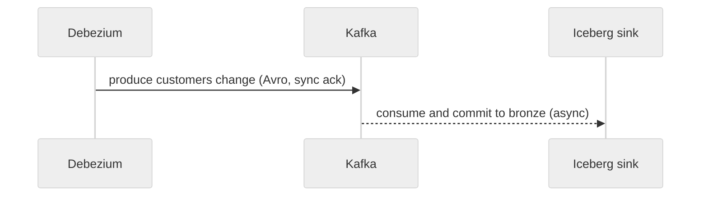

# Shopstream Documentation Style & Authoring Guide

This guide sets the writing standard for every Shopstream doc. Read it before authoring a PRD, TRD, ADR, REF, GUIDE or GLOSSARY. It states each rule and shows it in action.

## 1. Writing style

Apply these rules to every sentence you write.

**Use the active voice.** The actor performs the verb.

- Before: The schema is validated by the registry at produce time.
- After: The registry validates the schema at produce time.

**Omit needless words.** Cut filler; keep the claim.

- Before: It is important to note that dbt merges deletes into silver.
- After: dbt merges deletes into silver.

**Put statements in positive form.** Assert what is, not what is not.

- Before: The Kafka Connect sink does not support upserts.
- After: The Kafka Connect sink only appends.

**Use definite, specific, concrete language.** Name the thing, the count, the path.

- Before: The affinity job handles a lot of clickstream data.
- After: The affinity job joins 20–50M clickstream rows to products and customers.

**Place the emphatic word last.** End the sentence on what matters.

- Before: A report listing every failed reconciliation check is what the command returns.
- After: The command returns every failed reconciliation check.

Three more rules carry equal weight:

- **Keep related words together.** A subject and its verb belong side by side; a modifier sits next to what it modifies.
- **One topic per paragraph.** Open with the topic sentence; let the rest support it.
- **Use parallel structure for parallel ideas.** Matching ideas take matching grammar.

**Banned: AI-slop markers.** Each line below names a habit to delete on sight.

- No puffery: pivotal, crucial, vital, robust, seamless, cutting-edge.
- No empty -ing phrases: ensuring…, showcasing…, enabling…, leveraging….
- No buzzwords: delve, leverage, multifaceted, foster, realm, tapestry.
- No emoji decoration in body prose or headings.
- No bold on every other word; bold a term once, then leave it plain.
- No bullet list where two sentences read better.

**One rule above all: write what it does, not how impressive it is.**

## 2. Writing length by doc type

Match the doc to its target length and shape. The cap is a ceiling, not a goal.

| Type     | Target length                | Shape                                                                                                 |
| -------- | ---------------------------- | ----------------------------------------------------------------------------------------------------- |
| ADR      | 80–300 lines                 | MADR: Context and Problem Statement / Considered Options / Decision Outcome / Pros and Cons. One decision per ADR. |
| PRD      | 150–500 lines                | Consumers and outcomes first; Acceptance Criteria in EARS.                                           |
| TRD      | 200–800 lines (hard cap 800) | `§N` sections. Split if larger.                                                                       |
| REF      | 50–500 lines                 | SSOT tables, minimal prose.                                                                           |
| GUIDE    | 60–400 lines                 | Task-oriented steps.                                                                                  |
| GLOSSARY | 20–300 lines                 | One table.                                                                                            |

When a doc passes its cap, split it or move detail to a REF. Keep the primary doc readable; let the REF hold the tables.

## 3. Spec conventions (quick checklist)

The pre-flight checklist for any doc under `docs/specs/` or `docs/adr/`:

- **Frontmatter** opens every doc with at least `title`, `type`, `status`, `owner` (`platform` | `analytics-eng` | `governance`).
- **Status lifecycle:** Draft → Proposed → Accepted (or Rejected) → Active for in-use REF/GUIDE/GLOSSARY docs. Deprecated or Superseded marks a retired doc; cite the successor.
- **Typed relationship keys** take relative paths: `implements:`, `decided-by:`, `depends-on:`, `informs:`, `supersedes:`, `amends:`, `amended-by:`.
- **PRD Acceptance Criteria use EARS:** `WHEN [trigger] THE SYSTEM SHALL [behavior]`.
- **TRD `§N` numbering:** §1 Objective, §2 Architecture (Data Flow, Control Flow, Failure and Replay Flow), §3 Data Model / Contract, §4 Risk Assessment, §5 Testing Strategy, §6 Operational Boundaries.
- **Owner attribution:** each deliverable has exactly one owner role; a handoff names both sides and the artifact that crosses.
- **Naming:** `docs/specs/<domain>/<type>-<kebab>.md`; ADRs `docs/adr/adr-NNN-<topic>.md`, numbered by `just adr-new`.
- **Discoverability:** update `docs/documentation-map.md` only for a new canonical domain.
- **Proposed → Accepted** needs the `/shop-spec` Phase 6 critique at 13/15 or higher. Author and critique in separate passes; never self-approve.
- **Proof:** `just check` passes. It runs the docs lint.

## 4. Diagrams (normative)

A diagram that breaks these rules fails review.

- Every diagram is text-based Mermaid or ASCII. Attach no image files.
- Every diagram carries a caption line directly above it: `> **Figure N**: <caption>`.
- Sync flows use solid arrows (`->>`); async flows use dashed arrows (`-->>` in sequence diagrams, `-.->` in flowcharts). Node labels use verbatim component names. Edge labels state the protocol or payload.
- Keep a diagram under roughly 50 nodes. Split a larger one into focused views.

Every Mermaid block starts with the neutral theme, because GitHub renders the same diagram in light and dark mode and a fixed light palette breaks in dark mode:

```
%%{init: {'theme': 'neutral'}}%%
```

Example, init line plus a two-hop flow:



Preview diagrams in the PR's rendered file view before merging. Don't commit rendered images.

## 5. Placement: where content lives

One canonical home per flow; everywhere else links to the Figure and never redraws it. Check both tables before adding a flow narrative or a diagram.

**Flow placement:**

| Flow kind                                         | Canonical home                                                   | Everywhere else                     |
| ------------------------------------------------- | ---------------------------------------------------------------- | ----------------------------------- |
| Whole-system data, control or erasure flow        | [ref-architecture.md](../platform/ref-architecture.md) §4        | Link to the Figure; never redraw    |
| Owner-role seam (platform ↔ analytics-eng ↔ governance) | [ref-architecture.md](../platform/ref-architecture.md) §3 and §6 | Link                         |
| Pipeline- or job-internal                         | That component's TRD §2                                          | Link                                |
| CI/CD and release                                 | [ref-architecture.md](../platform/ref-architecture.md) §4       | Link                                |
| Data-product consumer flows                       | The owning PRD                                                   | System sequences stay in REF/TRD    |

**Diagram per doc type:**

| Doc type | Diagrams that belong                                   | Diagrams to omit                                  |
| -------- | ------------------------------------------------------ | ------------------------------------------------- |
| REF      | Context/topology + the canonical flow sequences        | Job-internal detail (the TRD §2 owns it)          |
| TRD      | §2 flows, scoped to that pipeline or job               | Whole-system topology (link to ref-architecture)  |
| ADR      | At most one, only when the decision hinges on topology | Anything restating a REF figure                   |
| GUIDE    | Only if it shortens the task path                      | Decorative or duplicate diagrams                  |
| PRD      | Consumer-flow level                                    | System sequences                                  |

See also: [CONTRIBUTING.md](../../CONTRIBUTING.md) (required sections per type) and `AGENTS.md` §6 (platform gotchas).
