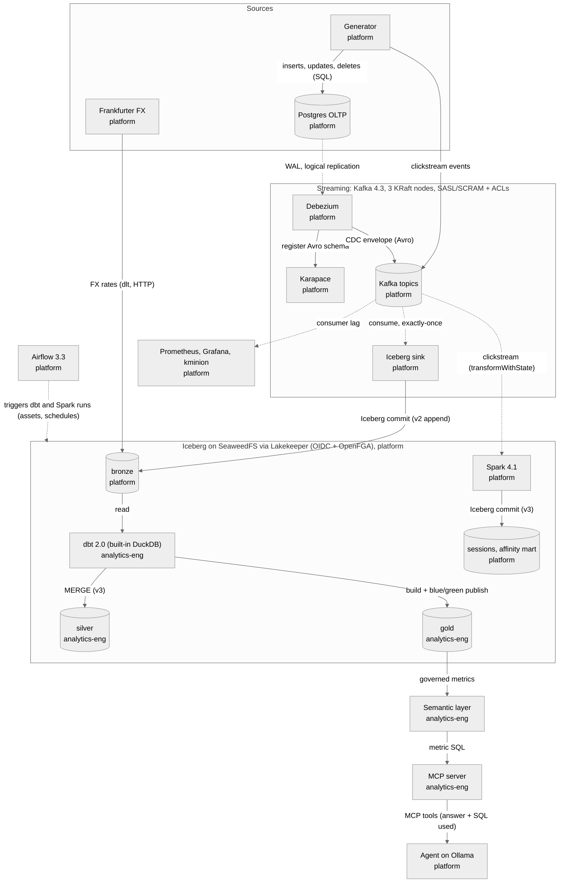
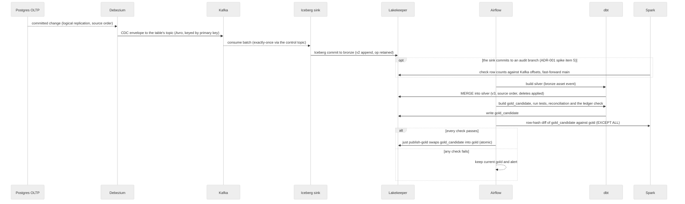
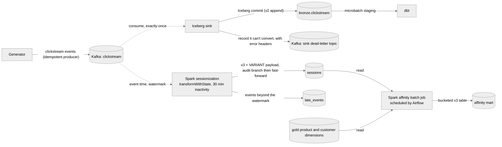
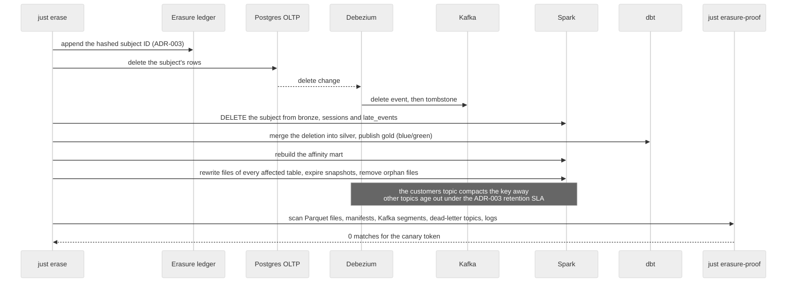
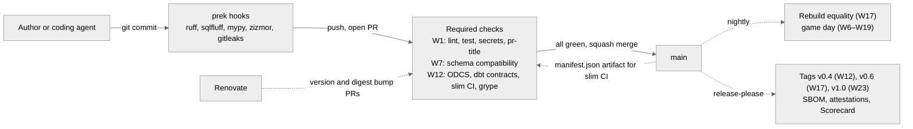

# Shopstream: Reference Architecture

## 1. Overview

> **SSOT declaration:** this document is the single source of truth for Shopstream's whole-system topology, component boundaries, canonical flows, data ownership and platform invariants.
> Consumers: every PRD, TRD, GUIDE and runbook under `docs/specs/`, and `/shop-spec`, which reads it before writing any architecture claim.

Shopstream is an open lakehouse that runs on one 16 GB laptop as Docker Compose profiles. A seeded generator writes a messy e-commerce business into Postgres and a clickstream into Kafka. Debezium captures the Postgres changes into Kafka, and the Iceberg sink lands every topic in bronze. dbt builds silver and a Kimball gold layer; Spark builds clickstream sessions and an affinity mart. Every table is Iceberg on SeaweedFS behind the Lakekeeper REST catalog, and Airflow orchestrates the chain. A semantic layer defines metrics over gold, and a custom MCP server lets a local agent query those metrics under a gold-only identity. GitHub Actions runs the same gates as the local hooks.

This is the target architecture. The Week 2 feasibility spike records its results in ADR-001 (W2), and where an Accepted ADR-001 disagrees with this document, the ADR wins (§9).

### 1.1 Common terms

The rest of the corpus uses these names. Where a thing has two names, the one defined here wins.

| Term                           | Means                                                                                                                                                                                                                                        |
| ------------------------------ | -------------------------------------------------------------------------------------------------------------------------------------------------------------------------------------------------------------------------------------------- |
| bronze                         | The raw landing namespace, all Iceberg v2. The Iceberg sink only appends to its CDC and clickstream tables (G3), which keep one row per Kafka record with the Debezium `op` retained; dlt writes `bronze.fx_rates` idempotently.            |
| silver                         | The cleaned namespace dbt builds from bronze: current-state entity tables with CDC changes applied in source order, deletes included, plus clickstream staging. Iceberg v3, because every model sets `format-version=3` (G1).              |
| gold                           | The published Kimball namespace: conformed dimensions (`dim_customer` as SCD2, `dim_product`, `dim_date`) and facts at a declared grain (`fct_orders`, `fct_order_items`, `fct_payments`). The only namespace `reader-agent` can read.     |
| gold_candidate                 | The namespace dbt builds the next gold into. Nothing reads it except the publish checks.                                                                                                                                                    |
| WAP (write-audit-publish)      | Commit to an audit branch, validate, then fast-forward `main`. Spark runs it on sessions, and on bronze if the sink can commit to a branch (ADR-001 spike item 5). DuckDB-written tables can't use it: DuckDB has no branches (G2).      |
| blue/green publish             | dbt builds `gold_candidate`; dbt tests, reconciliation, the erasure-ledger check and a Spark SQL row-hash diff against current gold run; only when all pass does an atomic swap (table rename or view repoint, chosen by ADR-001) make the candidate gold. `just publish-gold`. |
| erasure ledger                 | The record of erasure requests as hashed subject IDs (ADR-003, W5). `governance` defines it, `just erase` appends to it, and every rebuild and restore reapplies it.                                                                        |
| erasure canary                 | One generated customer whose unique token is planted in every place PII can hide. `just erasure-proof` searches for that token.                                                                                                             |
| sole writer                    | The one component that commits new rows to a table. The only other commits allowed are Spark's WAP fast-forward, erasure `DELETE` and rewrite, and table maintenance, listed per table in §6 (INV-01).                                      |
| source order                   | The Postgres commit order of CDC changes. The LSN is the expected ordering key, and the W3 time-model ADR makes it final. Never ingestion time.                                                                                              |
| simulated clock                | The generator's business time. SCD2 validity comes from it (the simulated `updated_at`), never from `now()`.                                                                                                                               |
| dead-letter topic (DLQ)        | A Kafka topic where the Iceberg sink writes each record it can't convert, with error-context headers. Only sink connectors have one; Debezium skips and logs (W8). |
| Iceberg sink                   | The Apache Iceberg Kafka Connect sink connector.                                                                                                                                                                                             |
| game day                       | A scripted failure injected into the running stack, with an assertion that the system detects, contains and recovers from it. Seven scenarios, run nightly by `just game-day` (W6–W19).                                                    |
| owner role                     | `platform`, `analytics-eng` or `governance` (the schema's `owner_enum`). One person plays all three; each deliverable still has exactly one.                                                                                                 |

## 2. Boundary and stack map

Everything in Figure 1 runs on the laptop. Outside the boundary sit GitHub Actions (Figure 5), the public Frankfurter API (never called; CI runs offline), and an external agent client such as Claude Code, which uses the same MCP server and `reader-agent` identity as the Ollama agent.

> **Figure 1**: Shopstream topology from sources to the agent. Each box names its owner role; dashed edges are asynchronous.

The Compose profiles list target versions, which ADR-001 (W2) confirms. Every service has an explicit `mem_limit`.

| Profile                  | Services                                                                                                                                                         | Target RAM |
| ------------------------ | ---------------------------------------------------------------------------------------------------------------------------------------------------------------- | ---------- |
| `core`                   | Postgres, SeaweedFS (latest; versioning and object-lock off, G5), Lakekeeper 0.13.x, OpenFGA, mock-oauth2-server (OIDC), Frankfurter                             | ~2 GB      |
| `streaming`              | Kafka 4.3.1 × 3 (combined KRaft, small heaps), Kafka Connect 4.3 running Debezium 3.6 and the Iceberg sink (Iceberg 1.11.x), Karapace (latest), Spark 4.1.x local | ~5–6 GB    |
| `orchestration`          | Airflow 3.3.2 (LocalExecutor), `apache-airflow-providers-apache-kafka` 2.0.0, `common-messaging` ≥ 2.0.0                                                         | ~2 GB      |
| `obs`                    | Prometheus, Grafana, kminion                                                                                                                                     | ~1 GB      |
| `ai`                     | Ollama (7–9B model, Q4) and the MCP server                                                                                                                       | ~6–7 GB    |
| Python packages (uv), not Compose services | dbt 2.0.x (bundles DuckDB 1.5.5), standalone DuckDB 1.5.x, PyIceberg 0.12, dlt; MetricFlow ≥ 0.209 in its own uv package, only if ADR-001 picks it | —          |

The allowed combinations are `core + streaming + orchestration` (≤ 10 GB), `core + streaming + obs`, and `core + ai` with streaming and orchestration stopped (INV-20). The Spark affinity batch runs with the streaming job paused, or each Spark application gets its own memory cap.

## 3. Component boundaries

One row per deployable component. The component's TRD owns how it works; this table owns what it may touch.

| Component                                    | Owns                                                                                                                                                                                                                              | Must not                                                                                                                                                                            | Owner         |
| -------------------------------------------- | --------------------------------------------------------------------------------------------------------------------------------------------------------------------------------------------------------------------------------- | ----------------------------------------------------------------------------------------------------------------------------------------------------------------------------------- | ------------- |
| Postgres OLTP                                | The source tables `customers`, `products`, `orders`, `order_items`, `payments`; the publication and replication slot Debezium reads.                                                                                             | Add a foreign key on `order_items.product_id` (the late-product knob relies on its absence). Grant the Debezium role more than `REPLICATION` + `SELECT` on captured tables (W8).    | platform      |
| Generator                                    | The history backfill and the live simulator, both writing Postgres on the simulated clock; clickstream events; every messiness knob, including the hot key, the erasure canary and one seeded prompt-injection review.           | Stamp business time with `now()`. Produce clickstream without idempotence, which the producer asserts at startup (W6).                                                              | platform      |
| Debezium 3.6                                 | One CDC topic per captured table; the Avro envelope (`before`, `after`, `op`); delete tombstones; initial snapshots.                                                                                                             | Expect a DLQ: a source connector only skips and logs (`errors.tolerance`). Let the replication slot lag unwatched (slot-lag check, W8).                                             | platform      |
| Kafka 4.3.1 (3 KRaft nodes)                  | Brokers and topics (replication factor 3); one SCRAM user per service; per-topic ACLs; consumer groups on KIP-848 (`group.protocol=consumer`).                                                                                  | Grant a principal access beyond its own topics: the clickstream producer can't read `orders` (W6). Depend on share groups, whose Python client is preview-only (G9).               | platform      |
| Karapace                                     | Avro subjects and their compatibility modes (§5).                                                                                                                                                                                 | Accept a schema that breaks its subject's mode (game day #2).                                                                                                                       | platform      |
| Iceberg sink (Kafka Connect)                 | The CDC and clickstream bronze tables (v2, append-only, exactly-once, `op` retained); its control topic; its dead-letter topic.                                                                                                  | Upsert or write v3: it only appends v2 (G3). Drop a record: `errors.tolerance=all` routes each record it can't convert to the dead-letter topic (W9).                               | platform      |
| Frankfurter and the dlt FX pipeline          | ECB rates for about 30 currencies on business days, served by the self-hosted container; `bronze.fx_rates`, which dlt writes idempotently.                                                                                       | Call the public Frankfurter API; CI stays offline. Write anywhere but the Lakekeeper REST catalog: with no catalog configured, dlt falls back to a local SQLite catalog. | platform      |
| SeaweedFS                                    | The S3 buckets holding Iceberg data, delete and metadata files, and the S3 identities scoped to them. | Turn on bucket versioning or object-lock (G5, conditional-write bug #8073).                                                                                                         | platform      |
| Lakekeeper 0.13 + OpenFGA + OIDC             | The Iceberg REST catalog for every namespace; running mock-oauth2-server (OIDC) and OpenFGA, which enforce the clients and grants `governance` defines (§3.1); storage credentials (STS vending, or remote signing if vending fails, ADR-001 spike item 1); the catalog database. | Run with authentication off, which disables OpenFGA (G6). Serve a component that lacks its own OIDC client; the W5 list (`spark-writer`, `dbt-transformer`, `reader-agent`, `admin`) needs two more in W9, for the Iceberg sink (`iceberg.catalog.credential`) and dlt. Run its own snapshot-expiry or orphan-removal queue unless ADR-002 names it the owner (INV-07). | platform      |
| dbt 2.0 (built-in DuckDB 1.5.5)              | Silver and gold models; `gold_candidate` builds and `just publish-gold`; dbt contracts, groups and access modifiers; unit tests; the reconciliation model; the shared CDC-ordering macro; the salted-hash pseudonymization macro. | Create a silver table without `format-version=3`, since DuckDB defaults to v2 (G1). Use branches or WAP (G2). Write bronze or a Spark-owned table.                               | analytics-eng |
| Spark 4.1 + Iceberg 1.11                     | The sessionization streaming job; the affinity batch job; WAP fast-forward on bronze and sessions; erasure `DELETE` and file rewrite; all table maintenance (compaction, snapshot expiry, orphan removal, manifest rewrite); the publish row-hash diff. | Commit new rows to silver, gold or `gold_candidate`; its only commits there are the §6 rewrite and maintenance. Run on the official `spark:4.1.x` Python image, which ships Python 3.10 (G12). Run the affinity batch beside the streaming job without per-application memory caps. | platform      |
| Airflow 3.3                                  | The asset chain bronze → silver → gold with blue/green publish; the affinity schedule; the maintenance DAG (hourly bronze compaction, daily silver and gold); the event-driven FX refresh through a Kafka `AssetWatcher`; Airflow roles. | Write table data itself; each task calls the table's owning engine.                                                                                                              | platform      |
| Observability (Prometheus, Grafana, kminion) | Freshness, lag, DLQ-depth and failed-run panels; the SLO alert routed to a webhook (INV-26); the Elementary report. | Collect record payloads; metrics carry counts, ages and lag.                                                                                                                        | platform      |
| Semantic layer                               | 8–12 governed metrics over gold, with their entities and dimensions. The engine is MetricFlow or the Boring Semantic Layer, per ADR-001.                                                                                         | Define a metric over bronze or silver.                                                                                                                                              | analytics-eng |
| MCP server                                   | The tools `list_metrics`, `get_dimensions` and `query_metrics`; guardrails (return the metric and SQL used, a row cap, a timeout, refusal of undefined metrics); a redacted audit log of tool calls; the eval harness (`just eval`). | Run SQL that no defined metric produced. Use any identity except `reader-agent`.                                                                                                  | analytics-eng |
| Ollama                                       | Local model inference for the agent and the eval harness, with the model pinned by digest (W22).                                                                                                                                  | Reach a table except through the MCP server.                                                                                                                                        | platform      |

### 3.1 Owner-role handoffs

| From → to                         | Artifact that crosses                                                          | Drawn in |
| --------------------------------- | ------------------------------------------------------------------------------ | -------- |
| platform → analytics-eng          | Bronze tables: v2 append, `op` retained                                        | Figure 2 |
| platform → analytics-eng          | Airflow asset events that start dbt builds                                     | Figure 2 |
| platform → analytics-eng          | The Spark row-hash diff of `gold_candidate` against gold                       | Figure 2 |
| analytics-eng → platform          | Freshness and volume SLOs in dbt `meta`, which become Grafana alerts (W16)     | —        |
| governance → platform             | The OpenFGA authorization model and the OIDC client list (W5)                  | —        |
| governance → platform, analytics-eng | Erasure ledger entries (ADR-003) and retention windows (ADR-002)            | Figure 4 |
| governance → platform, analytics-eng | The PII column list; each table's writer sets metrics `none` on it (ADR-003, INV-08) | — |
| governance → analytics-eng        | ODCS contracts with PII classification (W12)                                   | —        |
| platform → governance             | The `just erasure-proof` report                                                | Figure 4 |

## 4. Canonical flows

Each whole-system flow is drawn here once. Other documents link to the Figure and never redraw it; component-internal flows live in that component's TRD §2.

### 4.1 CDC to bronze, silver and gold (blue/green)

> **Figure 2**: A committed Postgres change travels through Kafka and bronze to a published gold layer.

- Debezium keys each record by primary key, so one key's changes stay in commit order on one partition.
- One tested dbt macro applies changes in source order, collapses same-batch duplicates and applies deletes (INV-09). SCD2 validity comes from the simulated clock, and one customer's versions never overlap (INV-22).
- `ALTER TABLE` drift takes the same path, and Karapace accepts it under FULL on `customers` (W8).
- A late product arrives after orders reference it; gold shows it as an inferred member and corrects it later (INV-23).
- The sink documents `iceberg.tables.default-commit-branch`. Spike item 5 tests it against Lakekeeper, and ADR-001 decides whether bronze uses WAP and what a bad bronze commit rolls back to.

### 4.2 Clickstream to sessions and the affinity mart

> **Figure 3**: Clickstream events become sessions and the affinity mart; unconvertible and late events take their own paths.

- Malformed, duplicate and out-of-order events enter on this path. Postgres rejects values of the wrong type and Debezium keeps per-key order, so the CDC path can't carry them.
- The affinity job joins `dim_customer` as of each event's time, taking the one version whose validity covers it, so the join neither drops nor duplicates events (INV-24).
- The hot key puts a large share of traffic on one product and one customer. The W14 tuning report picks the skew fix (AQE, salting, or bucketed tables with storage-partitioned joins), and production runs the fastest variant.

### 4.3 Erasure request, end to end

> **Figure 4**: `just erase` removes one data subject from every copy, and `just erasure-proof` checks that nothing is left.

- Deletion vectors mask rows; they don't erase them (G10). So Spark rewrites every affected table, including the dbt-written silver and gold and any retired gold copy the swap keeps, before it expires snapshots and removes orphans. This is ADR-002's immediate-expiry exception path.
- PII also hides in manifest column bounds (INV-08 prevents it), Debezium `before` images (bronze rows, which Spark deletes), Airflow and eval logs, and `pg_dump` backups. Backup retention stays within the erasure SLA (ADR-002).
- SeaweedFS versioning stays off (G5), so a removed file leaves no old version behind.
- `just rebuild` and `just disaster-drill` reapply the ledger, so a replay or a restore can't resurrect the subject (INV-05).
- The publish checks include the ledger, so a candidate built from pre-erasure silver fails and never swaps; a publish racing `just erase` can't bring the subject back (INV-11). ADR-003 defines how ledger hashes match gold keys.
- If a warehouse enables Lakekeeper soft deletion, a dropped table stays recoverable until it expires; ADR-002 keeps that window within the erasure SLA.

### 4.4 CI and release

> **Figure 5**: A change passes the local hooks and the required checks before a squash merge; later weeks add contract gates, nightly proofs and tagged releases.

- Agent-written changes pass exactly the same gates as human changes (`AGENTS.md` §1).
- CI runs `just lint` with `SKIP=gitleaks`; the `secrets` job scans the full history instead (INV-03).
- Commit messages and PR titles follow Conventional Commits, and `pr-title` checks them. PRs are squash-merged.

## 5. Messaging and transport roles

Kafka security, replication and consumer-group rules are in §3; this section owns the topics and transports.

| Topic                                                                   | Key                                        | Producer                  | Consumers                                     | Schema compatibility                          | Retention                                         |
| ----------------------------------------------------------------------- | ------------------------------------------ | ------------------------- | --------------------------------------------- | --------------------------------------------- | ------------------------------------------------- |
| CDC, one per table: `customers`, `products`, `orders`, `order_items`, `payments` | Primary key                     | Debezium                  | Iceberg sink                                  | BACKWARD; FULL for `customers` and `orders`   | `customers` compacted (W8); the rest per ADR-003 |
| `clickstream`                                                           | Chosen in the W7 producer benchmark        | Generator                 | Iceberg sink, Spark sessionization            | BACKWARD                                      | Per ADR-003                                       |
| Sink dead-letter topic, one per sink connector                          | The failed record's key                    | Iceberg sink              | Operators (DLQ-depth panel), `just erasure-proof` | None: the raw record plus error-context headers (`errors.deadletterqueue.context.headers.enable`)        | Per ADR-003; it holds PII                         |
| Sink control topic (`iceberg.control.topic`, default `control-iceberg`) | —                                          | Iceberg sink              | Iceberg sink coordinator and workers          | Internal                                      | Set by the sink                                   |
| Kafka Connect config, offset and status topics; Karapace `_schemas`     | —                                          | Kafka Connect, Karapace   | Kafka Connect, Karapace                       | Internal                                      | Compacted                                         |

Karapace's default compatibility is BACKWARD, and `customers` and `orders` use FULL (W7). A CI step checks each candidate schema against the registry before merge. The sink commits every 5 minutes by default (`iceberg.control.commit.interval-ms`), which sets the small-files budget (W9).

| From → to                             | Transport                                                                                              | Identity                                                                                       |
| ------------------------------------- | ------------------------------------------------------------------------------------------------------ | ---------------------------------------------------------------------------------------------- |
| Postgres → Debezium                   | Logical replication slot and publication                                                               | A role limited to `REPLICATION` + `SELECT` on captured tables (W8)                             |
| Clients → Kafka                       | Kafka protocol over SASL/SCRAM                                                                         | One SCRAM user per service, per-topic ACLs (W6)                                                |
| Engines → Lakekeeper                  | Iceberg REST catalog over HTTP                                                                         | One OIDC client per service (W5)                                                               |
| Engines → SeaweedFS                   | S3 API with STS credentials vended by Lakekeeper, or remote signing if vending fails (ADR-001 spike item 1) | Short-lived credentials from Lakekeeper. DuckDB can't remote-sign (G2), so that fallback gives it a static bucket key that bypasses OpenFGA; ADR-001 records it |
| dlt → Frankfurter                     | HTTP inside Compose                                                                                    | None; no key is needed                                                                         |
| Airflow → Kafka                       | `AssetWatcher` with a `MessageQueueTrigger`                                                            | Airflow's SCRAM user                                                                           |
| Agent → MCP server → semantic layer   | MCP tool calls                                                                                         | `reader-agent`, gold only (INV-06)                                                             |

If ADR-001 takes the static-key fallback, three controls compensate. The key belongs to a SeaweedFS identity for dbt alone, scoped with bucket-level actions (read bronze; write silver, gold and `gold_candidate`), so each of those layers gets its own bucket. The key lives only in `.env`. `just test-authz` shows it can't write bronze (INV-27).

Every credential in this table (SCRAM passwords, OIDC client secrets, any bucket key) lives in an untracked `.env` that Compose reads; the repo ignores `.env*` except `.env.example`. CI takes credentials from GitHub Actions secrets, and gitleaks blocks any that reach git (INV-03).

## 6. Data ownership

Each table has exactly one sole writer (INV-01). The "Other commits" column lists the only exceptions; any other writer is a defect. Standalone DuckDB, PyIceberg and Polars are read-only engines here; PyIceberg and Polars can't write v3 anyway (G4). Each topic's single producer is in §5.

| Data                                                                              | Sole writer                        | Other commits                                              | Readers                                                                 | Format                                   |
| --------------------------------------------------------------------------------- | ---------------------------------- | ---------------------------------------------------------- | ----------------------------------------------------------------------- | ---------------------------------------- |
| `bronze` CDC tables (`customers`, `products`, `orders`, `order_items`, `payments`) | Iceberg sink                       | Spark: WAP fast-forward, erasure `DELETE`, maintenance     | dbt (silver), `just rebuild`                                            | v2, append (G3)                          |
| `bronze.clickstream`                                                              | Iceberg sink                       | Spark: WAP fast-forward, erasure `DELETE`, maintenance     | dbt (clickstream staging)                                               | v2, append (G3)                          |
| `bronze.fx_rates`                                                                 | dlt FX pipeline                    | Spark: maintenance                                         | dbt (as-of FX joins)                                                    | v2; only Spark and DuckDB write v3 (G4)  |
| `silver` tables                                                                   | dbt                                | Spark: erasure rewrite, maintenance                        | dbt (gold builds)                                                       | v3 via `format-version=3` (G1)           |
| `gold_candidate` tables                                                           | dbt                                | None                                                       | Publish checks: dbt tests, reconciliation, Spark row-hash diff          | Same as gold                             |
| `gold` tables                                                                     | dbt, through blue/green publish    | Spark: erasure rewrite, maintenance                        | Semantic layer, Spark affinity job (dimensions), Spark row-hash diff, DuckDB, PyIceberg, Polars | `format-version` set explicitly (G1) |
| Rebuild namespaces                                                                | dbt (`just rebuild`)               | None                                                       | The nightly row-hash comparison                                         | Same as silver and gold                  |
| `sessions`                                                                        | Spark sessionization job           | Spark: WAP fast-forward, erasure `DELETE`, maintenance     | Spark affinity job, PyIceberg, Polars                                   | v3 with a `VARIANT` payload              |
| `late_events`                                                                     | Spark sessionization job           | Spark: erasure `DELETE`, maintenance                       | Read-only engines                                                       | Set by the W13 job                       |
| Affinity mart                                                                     | Spark affinity batch job           | Spark: maintenance                                         | Read-only engines                                                       | v3, bucketed                             |
| Postgres source tables                                                            | Generator                          | `just erase` deletes the subject's rows                    | Debezium                                                                | Postgres                                 |
| Erasure ledger                                                                    | `just erase`                       | None                                                       | Spark erasure step, dbt, `just rebuild`, `just disaster-drill`          | Hashed subject IDs                       |
| Lakekeeper catalog database                                                       | Lakekeeper                         | `just disaster-drill` restores it from `pg_dump` (W20)     | Lakekeeper                                                              | Postgres                                 |

If the spike's throughput test (ADR-001 spike item 12) triggers the bulk-load fallback, Spark loads the W14 volume into a bronze table of its own, never into a table the sink owns.

## 7. Technology choices and trade-offs

This table indexes the decisions; each ADR holds the full reasoning. ADRs that don't exist yet appear as plain text with the week they land. `AGENTS.md` §1 requires an ADR before any new service, so rows without a numbered ADR name the week one is due.

| Choice                                                                                                   | Instead of                                   | Trade-off accepted                                                                                                                                         | ADR                                                                  |
| -------------------------------------------------------------------------------------------------------- | -------------------------------------------- | ---------------------------------------------------------------------------------------------------------------------------------------------------------- | -------------------------------------------------------------------- |
| Writer split: the sink writes bronze, dbt writes silver and gold, Spark writes sessions and the affinity mart and runs WAP, erasure and maintenance | One engine writing every layer | Three writers to run and secure. Each writes what its Iceberg support allows (G1–G4)                                                                     | ADR-001 (W2), spike items 2, 3, 5 |
| dbt 2.0 with built-in DuckDB for silver and gold                                                         | dbt-core 1.x with dbt-duckdb                 | A new release: the open `--defer` bug #16330 and parity gaps with dbt-duckdb v1. No branches (G2); `sqlfluff-templater-dbt` doesn't work with it (G11)    | ADR-001 (W2), spike items 3, 9 |
| Blue/green gold publish                                                                                  | WAP on gold                                  | Two copies of gold during a publish. WAP is impossible on DuckDB-written tables (G2)                                                                      | ADR-001 (W2), spike item 7                                            |
| Lakekeeper REST catalog with OIDC and OpenFGA                                                            | Apache Polaris, another Iceberg REST catalog | A 0.x catalog. OpenFGA works only with authentication on (G6), so every component needs an OIDC client                                                     | ADR-001 (W2), spike item 1 |
| SeaweedFS for object storage                                                                             | MinIO, whose community images were pulled    | Bucket versioning and object-lock stay off (G5)                                                                                                            | ADR-001 (W2) pins it; G5 records why |
| Kafka 4.3 with 3 combined KRaft nodes, SASL/SCRAM and ACLs                                               | One broker                                   | The `streaming` profile needs ~5–6 GB; the fallback is one broker, with game day #1 reframed as outage and retry                                           | ADR-001 (W2), spike item 8                                            |
| KIP-848 consumer groups                                                                                  | Share groups (KIP-932)                       | No queue semantics; the Python client supports share groups in preview only (G9)                                                                          | Optional side-lab ADR (W6)                                            |
| Spark `transformWithState` for sessionization                                                            | Flink SQL                                    | Micro-batch latency instead of per-event processing                                                                                                        | Optional side-lab ADR (W13)                                           |
| Spark batch for the affinity mart                                                                        | DuckDB                                       | JVM memory on a 16 GB laptop, so it runs with the streaming job paused                                                                                     | "When Spark instead of DuckDB" ADR (W14)                              |
| Semantic layer on MetricFlow or the Boring Semantic Layer                                                | The dbt Platform semantic layer              | MetricFlow needs `dbt-core` 1.11–1.12 and dbt-duckdb in a separate uv package                                                                              | ADR-001 (W2), spike item 4                                            |
| Custom MCP server                                                                                        | dbt-mcp                                      | Guardrails and their tests are ours to build; dbt-mcp's semantic-layer tools need a dbt Platform account (G7)                                             | ADR due before W21                                                    |
| Ollama with a local 7–9B model                                                                           | A hosted model API                           | Lower answer accuracy than a frontier model, which the W22 eval measures; the `ai` profile needs ~6–7 GB, so streaming stops                              | ADR due before W21                                                    |
| mock-oauth2-server for OIDC                                                                              | Keycloak                                     | No real user management; Keycloak with MCP OAuth 2.1 is a stretch item                                                                                     | ADR-001 (W2) version matrix |
| Self-hosted Frankfurter                                                                                  | The public Frankfurter API                   | One more container in `core`. ECB rates cover business days only, so every FX join is as-of                                                                | ADR-001 (W2), spike item 10                                           |
| Docker Compose profiles on one laptop                                                                    | Kubernetes (kind or Helm)                    | Only the allowed profile combinations (§2) can run at once                                                                                                 | DOC-ONLY Kubernetes ADR (unscheduled)                                 |
| Toolchain: prek, every Python tool pinned in `uv.lock`, Python 3.13                                      | Classic pre-commit; Python 3.12 or 3.14      | Spark needs its own image with Python 3.13, because the official images ship 3.10 (G12)                                                                    | [ADR-000](../../adr/adr-000-record-architecture-decisions.md)        |
| Four required CI checks: `lint`, `test`, `secrets`, `pr-title`                                           | One CI job                                   | Four statuses to keep green                                                                                                                                | [ADR-000](../../adr/adr-000-record-architecture-decisions.md)        |
| MADR 4.0 ADRs and docs-kit conventions, enforced by a pytest lint                                        | Plain MADR; ad hoc docs                      | Stock MADR tooling can't read these files unchanged                                                                                                        | [ADR-000](../../adr/adr-000-record-architecture-decisions.md)        |

## 8. Platform invariants

Each invariant names the test or recipe that proves it and the week that proof lands. A test name, a review finding or a code comment cites the ID.

| ID       | Invariant                                                                                                                                                         | Proof                                                                                  | Lands   |
| -------- | ----------------------------------------------------------------------------------------------------------------------------------------------------------------- | -------------------------------------------------------------------------------------- | ------- |
| `INV-01` | Each table has exactly one sole writer, and only the §6 exceptions commit beside it.                                                                               | W4 integration test; `just test-authz` also shows `dbt-transformer` can't drop bronze (W5) | W4    |
| `INV-02` | Every Compose image is pinned by digest.                                                                                                                           | `tests/test_repo_policy.py` (passes trivially until W2 adds the Compose file)         | W1      |
| `INV-03` | No secret enters git history.                                                                                                                                      | The `secrets` CI check (gitleaks over the full history) and the gitleaks pre-commit hook | W1    |
| `INV-04` | A rebuild from Kafka offsets and bronze snapshots equals current gold by row hash.                                                                                 | Nightly rebuild-equality job (`just rebuild --from <ts>`)                             | W17     |
| `INV-05` | An erased subject is absent from every copy: Parquet files, manifests, Kafka segments, dead-letter topics and logs. A rebuild or restore doesn't bring it back. | `just erasure-proof`; game day #7 (erase, then rebuild)                               | W19     |
| `INV-06` | `reader-agent` reads gold only; bronze and silver deny it.                                                                                                         | `just test-authz`                                                                      | W5      |
| `INV-07` | Snapshot expiry and orphan removal have the single owner ADR-002 names (target: the Spark maintenance DAG). Lakekeeper's own expire-snapshots and orphan-removal queues, off by default, stay off unless ADR-002 names them. | ADR-002; a W16 check reads both queue configs through Lakekeeper's management API, and with the DAG paused, snapshots past the window stay in place | W16 |
| `INV-08` | Every PII column in every layer (bronze, silver, gold, sessions) carries metrics mode `none` (`write.metadata.metrics.column.<col>=none`), so no manifest holds a PII bound. | W4 test that reads the manifests, not just the property, so a writer that ignores it fails; it covers each layer as it lands (bronze W9, silver W10, gold W11, sessions W13) | W4 |
| `INV-09` | dbt applies CDC changes in source order, collapses same-batch duplicates and applies deletes.                                                                      | dbt unit tests through the shared macro                                               | W10     |
| `INV-10` | Gold matches Postgres totals (counts, revenue) within the tolerance the gold PRD's completeness NFR sets (W11). A breach fails the publish checks, so gold isn't swapped. | Reconciliation model in `dbt build` | W11 |
| `INV-11` | A failing `gold_candidate`, including one that still holds an erased subject, never becomes gold. | `just publish-gold` with a deliberately bad candidate (W12); the ledger check (W19) | W12 |
| `INV-12` | A producer schema that breaks its subject's compatibility mode fails at the registry and in PR CI.                                                                | CI schema check; game day #2                                                           | W7      |
| `INV-13` | Losing one broker mid-produce loses no acknowledged record, and consumers continue.                                                                               | Game day #1                                                                            | W6      |
| `INV-14` | A record the sink can't convert lands in the dead-letter topic, and the sink keeps running.                                                                       | Game day #3                                                                            | W9      |
| `INV-15` | A Kafka Connect worker crash mid-commit leaves bronze with no duplicates and no gaps against Kafka offsets.                                                       | Game day #4                                                                            | W9      |
| `INV-16` | A contract-breaking dbt change can't merge, and a model can't `ref` another group's private model.                                                                | Game day #5; the dbt governance test                                                   | W12     |
| `INV-17` | Backfilling the same window twice leaves gold row hashes unchanged.                                                                                                | Game day #6                                                                            | W15     |
| `INV-18` | Events later than the watermark land in `late_events`, and sessions within it are correct.                                                                        | Streaming tests with late and out-of-order events                                     | W13     |
| `INV-19` | Every MCP answer returns the metric and SQL used, respects the row cap and timeout, and refuses undefined metrics. The seeded injection review causes no escalation. | MCP contract tests (W21); `just test-injection` (W22)                               | W21     |
| `INV-20` | Each allowed profile combination fits its RAM target, with a `mem_limit` on every service.                                                                        | `docker stats` evidence in ADR-001                                                     | W2      |
| `INV-21` | Every Lakekeeper client holds only the grants its §6 role needs: each writer writes only its own tables, and each reader reads only what §6 lists. | `just test-authz`: one allow and one deny case per client (W5 clients in W5; the sink and dlt clients in W9) | W5 |
| `INV-22` | One customer's `dim_customer` versions never overlap, and their validity comes from the simulated clock. | `non_overlapping_validity` test in `dbt build` | W11 |
| `INV-23` | An order item that references a product not yet in `dim_product` joins an inferred member, and the late product's arrival corrects it. | W11 late-product test | W11 |
| `INV-24` | The affinity join matches each event to exactly one `dim_customer` version, so it neither drops nor duplicates events. | Row-count check before and after the join | W14 |
| `INV-25` | Re-running the FX pipeline over the same dates leaves `bronze.fx_rates` unchanged. | W9 re-run test: identical row hashes | W9 |
| `INV-26` | A forced freshness breach fires the SLO alert to the webhook. The bounds live in dbt `meta` and the Grafana alert rules. | W16 forced-breach test | W16 |
| `INV-27` | If ADR-001 takes the static-key fallback, the key reads bronze but can't write it. | `just test-authz` | W5 |

Each operational failure mode has a runbook, written in W20 under the domain that owns it, and `platform` owns all six. Game days #5 and #6 fail a CI gate or a test before anything ships, so they need none.

| Failure mode       | Detected by                                 | Runbook (W20)                                                  |
| ------------------ | ------------------------------------------- | -------------------------------------------------------------- |
| Broker down        | Game day #1 (INV-13)                        | `docs/specs/ingestion/guide-runbook-broker-down.md`            |
| Registry rejection | Game day #2 (INV-12)                        | `docs/specs/ingestion/guide-runbook-registry-rejection.md`     |
| DLQ filling        | Game day #3 (INV-14), the DLQ-depth panel   | `docs/specs/ingestion/guide-runbook-dlq-filling.md`            |
| Connector stuck    | Game day #4 (INV-15)                        | `docs/specs/ingestion/guide-runbook-connector-stuck.md`        |
| SLO breach         | The SLO alert (INV-26)                      | `docs/specs/orchestration/guide-runbook-slo-breach.md`         |
| Erasure request    | Game day #7 (INV-05)                        | `docs/specs/platform/guide-runbook-erasure-request.md`         |

## 9. Precedence

1. Accepted ADRs outrank this REF, this REF outranks TRDs, and TRDs outrank PRDs. The PR that accepts an ADR changing a statement here also updates this REF.
2. Facts come from `AGENTS.md` §6 (Platform gotchas). A statement here that contradicts a gotcha is a defect in this REF: re-verify the gotcha, then fix whichever is wrong.
3. Document fields come from the schema. Required sections and naming come from CONTRIBUTING.
4. A TRD's topic and table contracts match §5 and §6. A TRD adds detail; it never adds a writer.
5. Other documents link to a Figure here and never redraw it ([guide-doc-style](../guide/guide-doc-style.md) §5).

| Domain                                                          | Canonical source                                                                     |
| --------------------------------------------------------------- | ------------------------------------------------------------------------------------ |
| Topology, component boundaries, flows, sole writers, invariants | This document                                                                        |
| Platform facts                                                  | [`AGENTS.md`](../../../AGENTS.md) §6                                                 |
| Decisions                                                       | `docs/adr/`, starting at [ADR-000](../../adr/adr-000-record-architecture-decisions.md) |
| Frontmatter fields, types, statuses, owners                     | [`frontmatter-schema.yaml`](../../tooling/frontmatter-schema.yaml)                   |
| Required sections and naming                                    | [CONTRIBUTING](../../CONTRIBUTING.md)                                                |
| Style, diagrams and flow placement                              | [guide-doc-style](../guide/guide-doc-style.md)                                       |
| Component internals, job and table contracts                    | That component's TRD                                                                 |
