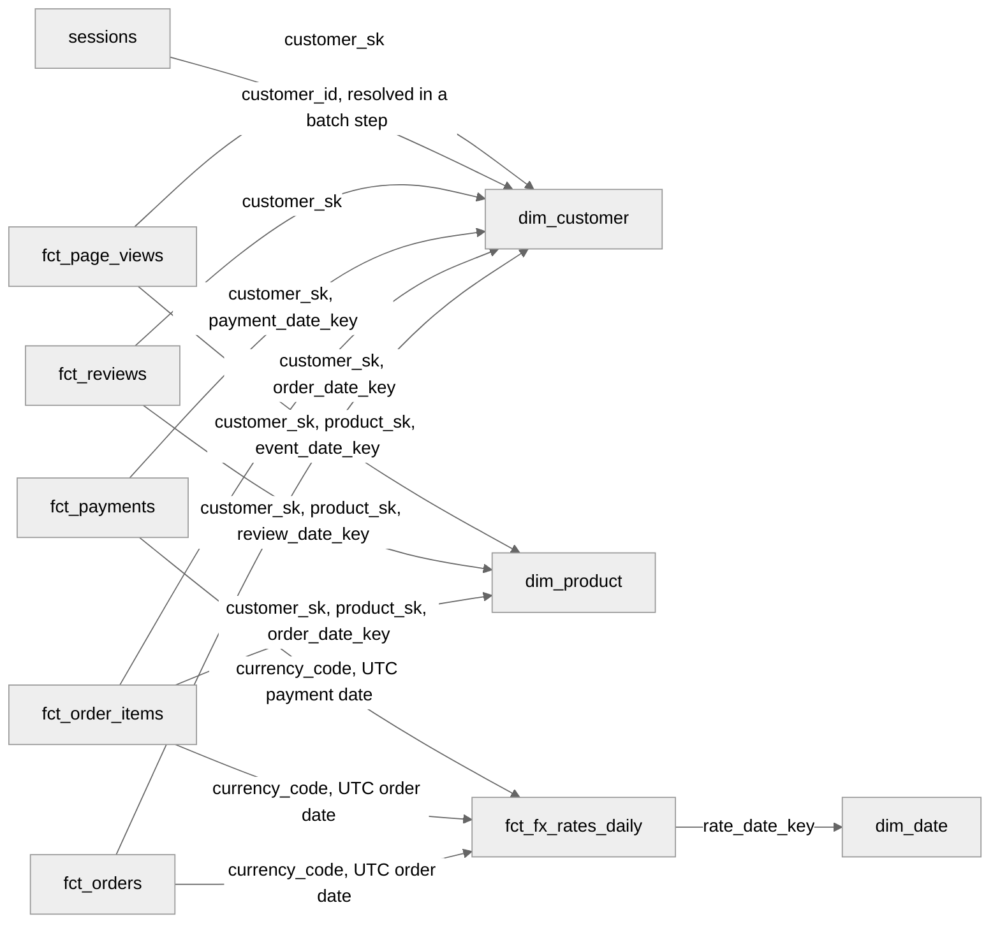

# Bus Matrix and Dimensional Model Reference

> **SSOT declaration:** this document is the single source of truth for Shopstream's dimensional model: the business processes in gold, each fact table's grain, key, type and measures, the conformed dimensions and their SCD policy, the naming convention, and the source attributes gold needs from the generator.
> Consumers: the dbt silver and gold models (Weeks 10 and 11), reconciliation (INV-10), Spark sessionization (Week 13), the semantic layer and MCP server (Week 21), and the generator's grain-key property ([ADR-005](../../adr/adr-005-generator-verification.md) P1).

## 1. Overview

Gold is a set of star schemas: transaction, factless and periodic-snapshot facts that share conformed dimensions. One Big Tables live downstream of gold, each built from the stars for one named consumer, never as gold itself; the semantic layer joins through the stars' entities. [ADR-004](../../adr/adr-004-time-model.md) owns every time rule used here: which clock orders changes, which drives validity, how dates are taken and when a fact waits for its FX rate. Physical ownership (namespaces and sole writers) is in [reference architecture](../platform/ref-architecture.md) §6.

## 2. Bus matrix

A ✓ means the process uses the dimension at its grain, through the named role. A — is a design statement: the dimension has no single value at that grain.

| Process | Fact table | Fact type | Date (role) | Customer | Product | Currency | Degenerate |
| ------- | ---------- | --------- | ----------- | -------- | ------- | -------- | ---------- |
| Orders | `fct_orders` | Transaction | ✓ `order_date_key` | ✓ | — an order holds many products | ✓ | `order_id` |
| Order items | `fct_order_items` | Transaction | ✓ `order_date_key` | ✓ | ✓ | ✓ | `order_id` |
| Payments | `fct_payments` | Transaction | ✓ `payment_date_key` | ✓ | — a payment covers the whole order | ✓ | `payment_id`, `order_id` |
| Product reviews | `fct_reviews` | Transaction | ✓ `review_date_key` | ✓ | ✓ | — a review has no amount | `review_id` |
| Sessions | `sessions` | Transaction, derived grain | ✓ `session_start_date_key` | ✓ through `customer_id` (unknown member when anonymous) | — a session views many products or none | — a session holds several orders, or none | `session_id`, `visitor_id` |
| Clickstream events | `fct_page_views` | Factless | ✓ `event_date_key` | ✓ (unknown member when anonymous) | ✓ (not-applicable member off product pages) | — a page view has no amount | `event_id`, `visitor_id` |
| FX rates | `fct_fx_rates_daily` | Periodic snapshot | ✓ `rate_date_key` | — | — | ✓ quote currency | — |

Read by column, the matrix shows how to drill across: customer is conformed across six processes and product across three. A cross-process question queries each fact separately, groups by the same conformed attributes and merges the answers; two facts are never joined directly.

> **Figure 1**: Each fact table and the conformed dimensions it joins, by key. Every `*_date_key` also joins `dim_date`; those edges are left out.

## 3. Grains and keys

A grain is declared in business terms first, then tested on its key: zero duplicate groups and no null key, in silver and gold, never in bronze, which holds every change and planted duplicate by design. The "As of" column is the event time that sets the fact's date role and its as-was `customer_sk`.

| Fact | Grain | Grain key | As of |
| ---- | ----- | --------- | ----- |
| `fct_orders` | One row per order, as recorded by Postgres `orders` | `order_id` | `ordered_at` |
| `fct_order_items` | One row per order line, as recorded by `order_items` | (`order_id`, `line_number`); `order_item_sk = md5(order_id \|\| '\|' \|\| line_number)` is the single-column entity key | Its order's `ordered_at` |
| `fct_payments` | One row per payment event, a capture or a refund, as recorded by `payments` | `payment_id` | `paid_at` |
| `fct_reviews` | One row per review still published, as recorded by `reviews` | `review_id` | The review's `created_at` |
| `sessions` | One row per session: one visitor's distinct page views with no gap over 30 minutes of event time, excluding events beyond the watermark (rule version 1) | `session_id = md5(visitor_id \|\| '\|' \|\| epoch_us(session_start))` | Its first event's `event_ts` |
| `fct_page_views` | One row per page view after deduplication on `event_id`, as emitted to the clickstream topic | `event_id` | `event_ts` |
| `fct_fx_rates_daily` | One row per quote currency per calendar day inside that currency's spine window (ADR-004 FX rule 2), gap-filled from ECB publications on TARGET business days, EUR at 1.0 included | (`currency_code`, `rate_day`) | `rate_day` |

Every clock is the generator's simulated clock in UTC, and every date is the timestamp's UTC date (ADR-004). A change to a grain or to the sessions rule is a new table version, never an edit.

An event is beyond the watermark when its `event_ts` is more than 10 minutes behind the running maximum `event_ts` over the earlier offsets of its Kafka partition, the rule ADR-001 item 13 used. The rule reads only the event and its offsets, so a replay from Kafka or bronze classifies the same events, as long as the clickstream topic's partition count and key stay fixed; changing either is a new rule version; Week 13's job implements it instead of a trigger-dependent watermark, and INV-18 tests it. `fct_page_views` holds every well-formed event, beyond the watermark or not. Malformed events stay in the sink's dead-letter topic and reach neither table, and Spark writes the beyond-watermark events to `late_events`.

A session's customer is the first non-null `customer_id` among its events in `event_ts` order, or none for an anonymous session. Its as-was `customer_sk` is taken as of that first identified event's `event_ts`, not `session_start`, because a visitor who signs up mid-session has no customer version at the session's start.

## 4. Measures

| Fact | Measure | Additivity | Rule |
| ---- | ------- | ---------- | ---- |
| `fct_orders` | `line_count` | Additive | Lines of the order |
| `fct_orders` | `gross_amount`, `discount_amount`, `net_amount` | Additive within one `currency_code` | Sums of the order's lines, so the order and its lines carry one definition; `discount_amount` equals the header's `order_discount` |
| `fct_orders` | `net_amount_eur` | Additive | The sum of its lines' `net_amount_eur`, never a second conversion of the header total |
| `fct_order_items` | `quantity` | Additive | — |
| `fct_order_items` | `unit_price` | Non-additive | Price at order time |
| `fct_order_items` | `gross_amount` | Additive within one currency | `quantity × unit_price` |
| `fct_order_items` | `discount_amount` | Additive within one currency | The header discount allocated in proportion to the line's positive `gross_amount`, rounded to cents; the rounding remainder goes to the largest line (ties by `line_number`), so the lines sum exactly to the header |
| `fct_order_items` | `net_amount`, `net_amount_eur` | Within one currency; EUR additive | `net_amount_eur = round(net_amount / rate, 2)` at the order's UTC date |
| `fct_payments` | `amount`, `amount_eur` | Within one currency; EUR additive | Signed: a capture is positive and a refund negative, so `SUM(amount)` is the net collected. `amount_eur` uses the rate at the payment's UTC date, so an order and its payment can convert at different rates; they reconcile in local currency |
| `fct_reviews` | `rating` | Non-additive | 1 to 5; averaged, never summed |
| `sessions` | `page_view_count`, `duration_seconds` | Additive | `page_view_count` counts distinct `event_id`s |
| `fct_page_views` | none | — | `COUNT(*)` is the measure |
| `fct_fx_rates_daily` | `rate`, `days_carried` | Non-additive | Units of the currency per 1 EUR; `days_carried = rate_day − published_date`, at most 4 |

`rate` is cast to `decimal(18,6)` on load, and every EUR amount is computed in exact decimal or integer arithmetic, never a double (DuckDB divides two decimals as a `DOUBLE`), rounding half away from zero to cents. A Week 11 test runs the same tie cases (amounts ending in .xx5 after division) through DuckDB and Spark and requires equal cents; the EUR reconciliation tolerance is the gold PRD's (INV-10). A ratio stores its numerator and denominator as additive measures and divides after summing.

Text attributes sit beside the measures: `fct_orders.status`, `fct_payments.payment_kind` and `payment_method`, `fct_page_views.page_type`, and `fct_reviews.review_body`. `review_body` is untrusted input: it holds the seeded prompt-injection review, every consumer treats it as data, never as instructions (INV-19), and a Week 11 test finds exactly one `fct_reviews` row whose `sha256(review_body)` equals ADR-005's hash.

## 5. Conformed dimensions and SCD policy

| Dimension | Surrogate key | Natural key | SCD policy | Special members |
| --------- | ------------- | ----------- | ---------- | --------------- |
| `dim_customer` | `customer_sk = md5(customer_id \|\| '\|' \|\| epoch_us(valid_from))` | `customer_id` | Type 2 on `city`, `country`, `tier` and `is_deleted`; Type 1 on `full_name` and `email`; Type 7 through `customer_id` on every fact | `-1` unknown (an anonymous visitor) |
| `dim_product` | `product_sk = md5(product_id)` | `product_id` | Type 1 on every attribute: `name`, `category`, `list_price`, `is_deleted` | Inferred members; `-1` unknown; `-2` not applicable |
| `dim_date` | `date_key`, an integer `YYYYMMDD` | `date` | Type 0 | — |
| Currency | No dimension table | `currency_code` | Not applicable | — |

- **`dim_customer`.** Validity, the current-version sentinel and the delete version follow ADR-004. A soft delete opens a final version with `is_deleted = true`. `tier` arrives through the schema-drift knob and reads null before it. Each version carries `attr_hash`, an `md5` over a JSON array of the Type 2 columns, so a change that touches only Type 1 columns opens no version. A fact joins `customer_sk` for the version valid at its "As of" time (as was) and `customer_id` for the current version (as is), so no Type 6 columns are needed.
- **A missing customer version.** The generator guarantees every referenced customer exists at the event time (ADR-005 P2), so a fact with no valid version only means bronze hasn't landed that customer's change yet. The mark that decides it is `bronze.customers`' landed maximum `updated_at`, since each table lands in its own sink commit; when `customers` is quiet, the mark also advances to the simulated time of any control point up to whose LSN bronze holds every CDC change (ADR-004 FX rule 5). Every as-of customer join, not only a missing one, waits until that mark passes the fact's event time, so a not-yet-superseded version is never picked; a fact still without a version after that fails the build as a defect, and a Week 11 test proves both cases.
- **`dim_product`.** A late-arriving product gets an inferred member: the real key `md5(product_id)`, placeholder attributes and `is_inferred = true`. The real row overwrites it in place when it lands, so the fact's key never changes (INV-23). `unit_price` on the fact keeps the price at order time.
- **`dim_date`.** Static, from 2020-01-01 to 2030-12-31. Beside the calendar attributes it carries `is_weekend` and `is_target_business_day`: from 2002 on, TARGET closes on weekends, 1 January, Good Friday, Easter Monday, 1 May, and 25 and 26 December, the rule ADR-001 item 10 matched against all 134 ECB closing days. Every date role is a named `*_date_key` with a `relationships` test to `date_key`, so a date past the range fails the build.
- **Currency.** Every money fact and `fct_fx_rates_daily` carry `currency_code`, an ISO 4217 `char(3)` whose domain is the vendored ECB list (ADR-005 P8). No metric groups by a currency attribute other than its code, and the code already identifies the transaction's true currency, so a `dim_currency` adds a join and no answer. Adding one later is a non-breaking change.
- **Special members.** `-1` and `-2` are string literals in the `varchar(32)` key columns. Each dimension that uses them holds one row per member, with `'Unknown'` or `'Not applicable'` attributes; in `dim_customer` that row is valid from `1970-01-01 00:00:00+00` to the sentinel.

Gold holds personal data in `dim_customer.full_name` and `dim_customer.email`, free text in `fct_reviews.review_body`, and subject identifiers in `customer_id` (on every fact) and `visitor_id` (on `sessions` and `fct_page_views`); silver and bronze also hold the clickstream `referrer`. A soft delete isn't erasure: the row stays until ADR-002's retention or ADR-003's erasure removes it, and erasure also follows the `visitor_id`s linked to the subject. `governance` owns the PII column list and ADR-003's pseudonymization boundary (Week 5); `analytics-eng` applies both in the Week 11 models and sets metrics mode `none` on these columns (INV-08).

## 6. Naming convention

| Element | Rule | Example |
| ------- | ---- | ------- |
| Fact table | `fct_<process>`, plural | `fct_order_items` |
| Dimension table | `dim_<entity>`, singular | `dim_customer` |
| Surrogate key | `<entity>_sk`: an `md5` hex string over the natural key's values joined by `'|'`, integers as decimal text and timestamps as `epoch_us` decimal text. Never a sequence, never DuckDB's `hash()` | `customer_sk` |
| Natural key | `<entity>_id`, as in the source | `customer_id` |
| Date role | `<role>_date_key`, an integer `YYYYMMDD` | `payment_date_key` |
| Timestamp | `<event>_at`, UTC `timestamptz`; clickstream keeps the contract's `event_ts` | `ordered_at` |
| Money | `<measure>_amount` in the transaction currency, `<measure>_amount_eur` in EUR, `decimal(18,2)`; the currency in `currency_code` | `net_amount_eur` |
| Flag | `is_<state>`, boolean | `is_inferred` |
| Validity | `valid_from`, `valid_to`, `is_current` | — |
| Special member | `-1` unknown, `-2` not applicable; an inferred member keeps its real key | — |
| Change hash | `attr_hash`: `md5` over a JSON array of the tracked columns | — |
| Publish marker | Every gold object carries `publish_id` (ADR-001, Gold publish) | — |

## 7. Source attributes

`platform`'s generator (Week 3) provides these columns, and `analytics-eng`'s silver and gold (Weeks 10 and 11) read them. Every table also carries `created_at` and `updated_at` on the simulated clock (ADR-004 C1 to C3), its primary key equals the grain key above, because CDC orders changes per primary key, and `REPLICA IDENTITY FULL` stays set (ADR-004). Other constraints and column types are the generator's choice.

| Source | Columns gold reads | Rules |
| ------ | ------------------ | ----- |
| `customers` | `customer_id`, `email`, `full_name`, `city`, `country`, `deleted_at`; `tier` once the drift knob adds it | `deleted_at` set means soft-deleted, and the customer never changes again until an erasure |
| `products` | `product_id`, `name`, `category`, `list_price`, `deleted_at` | A late product's insert follows its first order line (ADR-005) |
| `orders` | `order_id`, `customer_id`, `status` (`placed`, `paid`, `shipped`, `delivered`, `cancelled`), `currency_code`, `order_discount`, `ordered_at` | `order_discount` is non-null, at least 0, and at most the lines' positive gross; `ordered_at` falls within the customer's lifetime |
| `order_items` | `order_id`, `line_number`, `product_id`, `quantity`, `unit_price` | No foreign key on `product_id`; one product may sit on several lines; a `line_number` is never reused |
| `payments` | `payment_id`, `order_id`, `payment_kind` (`capture`, `refund`), `amount`, `currency_code`, `payment_method`, `paid_at` | Insert-only; `amount` is positive, and gold applies the sign from `payment_kind`; `currency_code` is its order's; refunds never exceed the order's captures |
| `reviews` | `review_id`, `product_id`, `customer_id`, `rating`, `body` | `rating` is 1 to 5; one review holds the seeded injection body |
| Clickstream `page_view` | `event_id`, `event_ts`, `visitor_id`, `customer_id`, `page_type`, `product_id`, `referrer` | `customer_id` is null when anonymous; `product_id` is set only on product pages; the contract in `contracts/clickstream/` owns the full field list |

The current `infra/postgres/init` schema predates this list: it has no `payments` table, names the line column `line_no` and the order currency `currency`. The Week 3 generator brings it in line.

## 8. Build rules

1. `dim_customer` derives from the bronze change log through the shared ordering macro (ADR-004), so it never reads its own previous state. Facts and the other dimensions build from silver's current state.
2. Each publish rebuilds the gold facts in full from silver, except where Week 14's measurement shows a full `fct_page_views` rebuild at its volume breaks the RAM budget (INV-20); that table then builds incrementally under the rule below. A Week 11 incremental build is allowed only if it selects every fact not yet published whose event date is within its currency's spine, plus every fact whose order is still within L of the build's cutoff (ADR-004 C5); `fct_page_views`, which has no currency, selects by event date instead, never by an `updated_at` or ingestion high-water mark, so neither a fact that waited for its rate nor a late status change or line delete is missed.
3. `fct_order_items` carries every header dimension key and `order_id`. A header amount is never summed after joining orders to lines.
4. Money facts first drop rows dated past their currency's spine end (they wait, ADR-004), then equi-join `fct_fx_rates_daily` on (`currency_code`, event UTC date), and a `not_null` test on the rate fails any row left without one. A Week 11 test shows a fact absent past the spine end and present once its rate loads.
5. `fct_page_views` resolves `customer_sk` as of `event_ts`, or `-1` for an anonymous visitor, and `product_sk` as `md5(product_id)`, or `-2` off product pages. `sessions` stores `customer_id`, not `customer_sk`, so the streaming job never depends on when `dim_customer` was published; a deterministic batch step resolves the key as of the session's first identified event (§3). Spark writes `sessions` (reference architecture §6), and whether gold also exposes it to the semantic layer is Week 13's call.
6. Reconciliation (INV-10) compares orders and lines with Postgres per (`currency_code`, order date) at ADR-004's FX rule 5 cutoff: counts and local amounts exactly, `net_amount_eur` within the gold PRD's tolerance. Payments reconcile the same way per (`currency_code`, payment date).
7. Every grain key gets `unique` and `not_null` tests in silver and gold (Week 11), and the generator proves the same keys on its output (ADR-005 P1).

## 9. Precedence Rules

1. Accepted ADRs outrank this REF; ADR-004 owns every time rule it cites. This REF outranks TRDs and PRDs on grains, keys, measures, SCD policy and names.
2. [Reference architecture](../platform/ref-architecture.md) §6 owns namespaces and sole writers; this REF adds no writer.
3. Where another document or a model names a gold column differently, this REF's name wins, and the other changes.
4. A change to a grain, a key or an SCD type here is a breaking change: it needs a new version of this REF and a versioned gold model, never an in-place edit of a published table.
